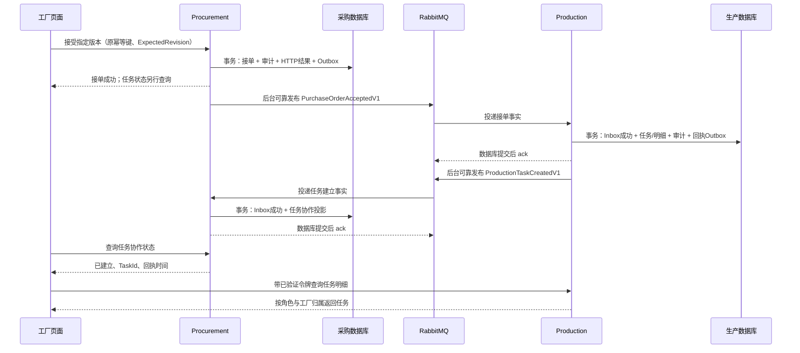

# 1C 计划：接单后可靠地建立生产任务

日期：2026-10-05（Asia/Shanghai）

状态：**已实现并完成本地验证，等待用户验收**。用户已授权实现并确认补建历史已接单订单；74 项后端测试通过，真实 PostgreSQL/RabbitMQ、Compose、两个 API、页面查询及停机恢复已验证。实际范围和限制见 [1C 验证记录](docs/VALIDATION-1C.md)，契约见 [API-1C](docs/API-1C.md)。以下保留设计理由与验收目标；后续阶段未提前实现。

总计划：[PLAN.md](PLAN.md)；前一阶段：[PLAN-1B.md](PLAN-1B.md)、[1B 验证记录](docs/VALIDATION-1B.md)。1B 已提交为 `469f794`，历史验证为 49 项后端测试通过；这些结果不能证明 1C 的消息可靠性。

## 1. 一个用例与完成标准

**工厂接受指定订单版本 → Procurement 保存接单事实和待发事件 → Production 自动建立唯一生产任务 → 回传任务建立事实 → 页面可查看任务和确认明细。**

这一步开始有两个业务微服务：Procurement 和 Production。每个服务的 Domain、Application、Persistence、API 是分层项目，分别组成一个可独立运行的 API 进程，不按项目数量计算微服务。

验收必须证明：RabbitMQ 或 Production 暂时不可用时，接单仍可成功保存；恢复后自动完成建任务；重复消息不产生第二个任务；页面不会把“消息已发送”显示为“任务已建立”。

1C 不上报完成量、不生成完成批次，不做延期、质检、放行、发货或 ERP。新增完成量及其数量并发约束留到 1D，Fulfillment 留到阶段 2。前端复用现有登录、订单详情和表格，只增加任务状态及查询。

## 2. 已有代码与本次改动入口

| 1B 基线实现 | 1C 已补的能力 |
| --- | --- |
| [PurchaseOrder.AcceptVersion](src/Procurement.Domain/PurchaseOrder.cs:121)校验版本与工厂，改变订单状态和修订号 | 成功接受时产生上下文内部的接单事实；失败行为不产生事实 |
| [SubmittedOrderVersion.Resolve](src/Procurement.Domain/SubmittedOrderVersion.cs:51)保存稳定 DecisionId、决定人和时间 | DecisionId 成为跨服务接单事实的业务标识，重试不换编号 |
| [ProcurementService.Accept](src/Procurement.Application/ProcurementService.cs:95)编排接单 | 将内部事实和已接受版本的内容快照映射为公开契约 |
| [ProcurementStore.ChangeOrder](src/Procurement.Persistence/ProcurementStore.cs:80)同事务保存 HTTP 幂等结果、订单、版本和审计 | 把 Outbox 加入这一个事务，不能提交后才拼装或发送事件；接单用例须加载指定版本的明细快照 |
| [ProcurementDbContext](src/Procurement.Persistence/ProcurementDbContext.cs:21)映射采购模型 | 新增采购 Outbox、Inbox、任务协作投影及消息失败记录；订单原字段含义不变 |
| [compose.yaml](compose.yaml:1)只有 PostgreSQL；[数据库初始化](infra/postgres/init.sh:1)只处理首次建卷 | 增量建立 Production 数据库和账号，加入 RabbitMQ；既有数据卷不能靠重跑首次初始化脚本升级 |

上表左侧描述实施前基线，右侧已完成；验证依据为 1C 实际记录。

## 3. 业务规则、数据归属与一致性

| 事项 | 规则与拥有最终判断权的服务 |
| --- | --- |
| 订单是否接受、接受哪个版本 | Procurement；沿用 1B 的身份、版本、修订号和并发规则 |
| 任务创建依据 | 只接受 Procurement 发布的已接单事实，包含明确版本、工厂和确认明细；不接受前端手工创建任务或传入订购上限 |
| 任务唯一性 | Production；一个接单版本建一个任务。1C 一张订单只允许一个已接受版本，因此不同版本/决定的冲突不能另建任务 |
| 确认内容 | Production 保存已接受版本的本地副本：交期、LineId、SkuId、商品说明和确认件数；它不成为修改采购承诺的入口 |
| 消息延迟跨过交期 | 不重新判断订单能否接单，不因交期已经过去丢弃有效事实；保留原承诺日期，页面可提示已过期 |
| 拒绝/撤回 | 不建立任务，不为这些行为发接单事件；与接受竞争失败的事务也没有 Outbox |
| 任务建立状态 | Procurement 的独立只读投影，允许最终一致；回执必须匹配本地已接受版本、DecisionId 和 FactoryId |
| 接单状态与任务状态 | 独立显示。建任务失败不会把 Accepted 改回 Submitted，也不会偷偷撤销工厂承诺 |

Production 不查询 Procurement 数据库，不通过同步查询补全缺失字段。完整的已接单事件是建任务的前置凭据；契约不完整就等待修复或记录阻塞，不能使用空明细、默认工厂或无限数量上限。

本地沿用一个 PostgreSQL 实例。Procurement 使用原数据库/账号；Production 新增 `scm_production` 和 `scm_production_test`，采用独立账号、密码、DbContext 和迁移。验证双方账号不能访问对方业务表，并收紧 PostgreSQL 默认的公共连接权限；管理员账号只用于受控建库，业务进程不使用管理员连接。

## 4. 两个本地事务，通过事件协作

接受订单使用同步 HTTP，响应只承诺采购本地事务完成。自动建任务和回执采用异步事件，允许服务离线后继续处理，不延长接单请求等待下游，也不使用分布式事务或 Saga。

生产任务的明细查询直接走 Production HTTP，由 Production 授权。采购状态查询只读自己的投影；两个查询暂时不一致时提示同步中或查询暂不可用，不修改任一服务的业务事实。

## 5. 最小领域模型与分层

- **Procurement.Domain**：新增轻量 `OrderVersionAccepted` 领域事实，由接受行为返回，含接单决定、订单/版本、工厂、修订号和时间。它不依赖 RabbitMQ、EF 或公开事件 DTO；不引入通用事件分发框架。
- **Procurement.Application / Persistence**：应用层把事实和指定快照转换为集成事件，交给既有持久化用例同事务保存；后台发布器读取 Outbox。HTTP 成功重放返回原结果，不再次执行行为或生成事件。
- **Production.Domain**：`ProductionTask` 聚合根及任务明细，使用 `CreateFromAcceptedOrder` 等业务入口，检查非空标识、1–100 条唯一明细、正整数确认量及完整商品说明。输入是内部业务数据，不是外部消息 DTO。任务记录 OrderId、AcceptedOrderVersion、DecisionId、FactoryId、原接单修订号和时间。
- **Production.Application**：入站契约经过校验和转换，再调用创建任务用例；负责业务重复/冲突语义与查询授权。
- **Production.Persistence / API**：EF 映射、迁移、事务、去重、消息 worker 与 Controller 查询入口；新增四层项目并加入独立解决方案，保持与采购一致的 API 风格。

两个服务不共享 PurchaseOrder、ProductionTask、状态枚举或领域数量类型。可增加一个小型 `Scm.IntegrationContracts` 项目，仅存实际使用的消息信封与 DTO，按发布服务命名空间标明契约所有权；Domain 不引用它。消息基础设施只有确实重复后才抽取，不搭通用仓储、万能事件总线或工作流框架。

## 6. 事件契约

信封包含 `MessageId`（即 EventId，重发保持不变）、`EventType`、`ContractVersion=1`、`FactId`、`SourceService`、`SourceRevision`、`OccurredAtUtc`、`CorrelationId`、`CausationId`、`TraceParent`；业务数据包含 `OrderId`、`AcceptedOrderVersion`、`FactoryId`。不按消息时间判断哪个事实覆盖哪个事实。

| 集成事件 | 业务标识与必要内容 |
| --- | --- |
| `PurchaseOrderAcceptedV1`，Procurement 拥有 | FactId=DecisionId；接受时修订号与时间、工厂说明、确认交期，以及明细 LineId/SkuId/款式/颜色/尺码/确认数量。数据来自指定提交快照，不序列化整个聚合 |
| `ProductionTaskCreatedV1`，Production 拥有 | FactId=TaskId；订单版本、工厂、DecisionId、任务建立时间及接单内容摘要。作为下游实际完成建任务的凭据 |
| `ProductionTaskCreationFailedV1`，Production 拥有 | 稳定失败记录编号、可验证的接单关联、内容摘要、公开错误代码；只用于能够关联到合法接单请求的永久业务阻塞，供采购显示失败 |

无法解析、未知契约版本或关联标识不可信的消息保留为技术失败记录，不能据其伪造某个订单的业务失败。数据库、网络暂时不可用只进入恢复等待，不发布永久失败事件。

按固定字段规范化业务内容并保存 SHA-256 摘要；明细排序不改变语义。消息去重比较完整语义内容，业务事实去重比较接单内容，排除重投时可能不同的 MessageId、关联追踪等传输信息。同一事实编号异内容必须显式冲突，不能静默覆盖。

成功回执只匹配本地已接受的版本、决定、工厂和内容摘要，更新独立投影，不增加 PurchaseOrder.Revision。Created 不被迟到失败降级；修复后收到匹配的 Created 可解除 Blocked。不存在的本地前置记录进入持久等待，不凭消息创建采购订单。

## 7. Outbox、Inbox 与失败恢复

### 7.1 发送侧

业务变更、审计、原 HTTP 结果与 Outbox 同事务提交。Outbox 至少保存消息编号、类型、事实编号、内容、摘要、创建时间、发送时间、尝试次数、下次尝试时间和最后错误；`UNIQUE(EventType, FactId)` 防止为同一事实追加两份出站记录。

后台 worker 不在请求中直发消息。发布使用持久消息、持久交换机/队列、`mandatory` 和 publisher confirm；不可路由、nack、超时或连接失败均不标记已发送。确认后才记录发送成功；confirm 后进程崩溃可能重发，由消费去重吸收。发送确认不代表任务已建立，依据 [RabbitMQ 确认机制](https://www.rabbitmq.com/docs/confirms)。

服务离线时队列也必须存在：启动发布器前由受控拓扑初始化建立两个方向的队列及绑定，不能等消费者首次启动才声明。只建立 1C 的订阅，不提前创建 Fulfillment 队列。首次连接失败也有重试循环；客户端重连不能替代 Outbox，依据 [官方 .NET 客户端指南](https://www.rabbitmq.com/client-libraries/dotnet-api-guide)。

1C 每个服务单发布 worker、受控单实例部署；数据库仲裁消费重复不依赖此限制。后台失败固定间隔重试，例如 5 秒并保留错误，永久契约错误转 Blocked；多实例发布领取、动态退避和容量治理留到实际需要时，不宣称已经支持水平扩展。

### 7.2 消费侧与三种幂等

| 层次 | 持久化仲裁及处理 |
| --- | --- |
| HTTP 请求幂等 | 保留 1B 的 `(SubjectId, Operation, IdempotencyKey)` + 摘要 + 原结果；接单重放不新增审计或 Outbox |
| 消息幂等 | 各消费者 `UNIQUE(ConsumerName, MessageId)` + 内容摘要。相同内容且 Processed 安全 ack；同编号异内容记录冲突，不视作成功重投 |
| 接单事实/建任务幂等 | Production 唯一 DecisionId、唯一 `(OrderId, AcceptedOrderVersion)`，1C 同时约束唯一 OrderId。不同 MessageId 携带同一决定、相同内容也只建一个任务；异内容或不同确认版本显式冲突 |

正常处理在同一个生产事务中仲裁 Inbox、创建聚合/明细、追加审计和回执 Outbox，最后标记 Processed 并提交；提交之后才 ack。采购消费回执也用同一事务保存 Inbox 成功记录和投影。唯一约束参与并发仲裁，不能仅“先查询不存在，再插入”。

生产任务已存在时校验原决定和快照内容，保留原 TaskId 和原回执 Outbox，不重复建任务或重复审计。若原回执未发，发布器继续发送；若已经发送但采购未处理，持久回执队列继续保留。

临时处理失败先回滚业务事务。数据库可用时持久保存消息原文、Pending、错误和下次处理时间，保存后可 ack，由后台重试；**Pending 不是消费成功**，重试成功仍将业务、回执 Outbox 与 Processed 同事务提交。数据库不可用、不能保存消息时不 ack，暂停消费并在恢复后重投，避免立即反复 requeue。

永久失败保留原文、摘要及原因为 Blocked，不无限重试或直接丢弃。提供仅限 Development 的受控命令查询/重试原记录，保留 MessageId 和 FactId，不能编辑原始已确认内容或伪造 Processed。错误日志脱敏，浏览器只显示公开原因和关联编号；完整运维页面、批量人工重放留到阶段 4。

### 7.3 本地新增数据

| 数据库 | 新增表的最小职责 |
| --- | --- |
| Procurement | `outbox_messages`、`inbox_messages`、`message_failures`；`production_task_links` 保存接单关联、TaskId、投影状态与回执时间 |
| Production | `production_tasks`、`production_task_lines`、`business_audit`；独立 Outbox、Inbox 和失败记录 |

这里的表名是拟定名称。生产订单引用只在本服务内关联任务，不建立跨服务外键。成功 Inbox/业务去重记录和 Outbox 暂不自动过期，保留策略在运维阶段明确。

## 8. 旧数据升级、身份与运行

**用户已确认（2026-10-05）：补建历史已接单订单。** 提供显式 Development 命令，先列出候选，再按原 DecisionId、原接单时间/修订号和已接受快照补入 Outbox 及 Pending 关联；记录补录审计。每个订单事务化执行，可重复运行，不重新接受、不推进订单 Revision、不修改原 HTTP 响应或历史决定。唯一事件事实键同时挡住重复补录和正常新事件。

升级先备份既有采购库，再执行新增迁移与建库脚本；不清除 Docker 数据卷或重建采购订单。部署切换时停止旧版采购写入，迁移并启用新接单事务后再运行补录，避免旧代码继续产生无 Outbox 的接单。补录缺少决定/快照或发现相互矛盾的数据时记录错误并停止该条，不猜测修复。

继续使用 Procurement 的 Development 演示登录。Production 自己验证 JWT 签名、issuer、audience、有效期、角色和工厂声明；不调用采购鉴权接口，不新增认证微服务。共享演示签名密钥是当前教学选择，生产身份提供商/非对称验证后续设计。

Buyer 可查询全部任务；Factory 只查本厂任务，归属来自已验证声明；本轮 Quality 不开放生产操作。列表和已知 ID 详情都做归属过滤，跨厂资源返回 404；任务创建入口只接受受控事件，不暴露匿名或工厂手工创建 API。

RabbitMQ 用独立 vhost、受控服务凭证和发布/消费权限；演示工厂账号无消息代理权限。数据库与消息密码写入忽略的本地环境配置，不放入契约、日志或版本库。

实施时已核实并固定 RabbitMQ 4.3.6、RabbitMQ.Client 7.2.2，镜像锁定 tag/digest，实际还原、构建与通信分别记录。原 global.json、EF/Npgsql 和前端锁文件沿用，不顺带升级；详细来源与结果见验证记录。

优先采用官方客户端和 ASP.NET Core BackgroundService，不加入 MassTransit、MediatR、gRPC、Redis、网关或服务发现。完善 Compose，允许 PostgreSQL、RabbitMQ、两个 API 和精简前端一起启动，同时保留本机调试脚本；新增端口和密钥在实施时统一写入 README。

## 9. API、页面与可观测性

拟定查询：采购提供订单任务协作状态（品牌与所属工厂分别授权）；Production 提供任务分页列表和详情。具体路由记入实施后的 `docs/API-1C.md`；不以当前计划中的描述冒充已存在 API。

| 页面显示 | 必须依据的事实 |
| --- | --- |
| 未接单 | 采购尚无已接受版本，无任务建立请求 |
| 历史订单尚未补建 | 已接单但未生成对应 Outbox/关联；补录后进入 Pending |
| 任务建立中 / 发送暂时失败，等待恢复 | Outbox 已落库且尚未收到匹配成功回执；展示最后更新与重试状态，不编造下游完成情况 |
| 建立受阻，需要处理 | 匹配的永久业务失败回执或本地永久发送错误；错误原因不泄露连接串等技术细节 |
| 已建立 | 匹配的 Created 回执已入采购库，显示 TaskId，可查询生产任务明细 |
| 明细查询暂不可用 | 查询 Production 失败；不把已建立投影改为未建立 |

页面用原生表格、fetch 和现有状态管理。等待回执时有限轮询，例如 2 秒一次、离开页面停止，超时显示“仍在等待回执”并支持手动刷新；不加 WebSocket、图表或 UI 框架。

两个 API 均保留 OpenAPI、ProblemDetails、JSON 日志和 TraceId；跨事件传播 CorrelationId/CausationId/TraceParent，使用 Activity 关联日志。增加/扩展 live、ready 和消息恢复状态：数据库故障与消息协作退化分开报告，broker 离线时仍允许可安全写 Outbox 的采购请求；检查结果不得把“发布成功”等同于下游完成。完整追踪后端和监控面板留到阶段 4。

## 10. 实施顺序与验收

| 步骤 | 本步可验收结果与学习重点 |
| --- | --- |
| 1C-1：接单事实与采购 Outbox | 接单行为、契约、采购迁移；原事务原子性、HTTP 重试及接受/撤回竞争测试。先学“业务事实和发消息为什么不能分两次提交” |
| 1C-2：真实消息与自动任务 | Production 四层实现、独立数据库、RabbitMQ 拓扑/发布/消费；接单自动产生唯一任务，服务离线后恢复 |
| 1C-3：回执、阻塞与页面 | 生产回执 Outbox、采购 Inbox/投影、失败/Pending 恢复、受控重试、工厂隔离和最小任务界面 |
| 1C-4：升级、交付与教学 | 真实历史补录、Compose/本机调试、CI、故障注入、启动与契约文档、实际验证记录；由用户验收 |

以上步骤已按用户的 1C 实施授权完成。下一步仅为用户验收；1D 仍需先制定计划。

必须使用真实 PostgreSQL 和 RabbitMQ；保留 49 项已有回归测试，新增测试数以实际结果为准。并发用独立连接及受控屏障，故障注入只在测试/演示环境，不进入正常业务流程。

| 验收场景 | 必须证明 |
| --- | --- |
| 正常与多明细 | 接单快照全部明细准确建立；原 LineId、SKU、工厂、版本、交期、数量一致；成功回执后显示任务 |
| 并发接单/撤回及重复 HTTP | 仅获胜接受有 Outbox；同键重放只一条事件、一个任务；拒绝/撤回不建任务 |
| 采购提交失败 | SQL 写入后、提交前注入错误，订单、决定、审计、HTTP 结果及 Outbox 全部回滚 |
| broker 停机与首次不可连接 | 接单数据不丢；worker 有恢复尝试；恢复 broker 后自动建任务；应用启动不依赖首次连通 |
| Production 尚未首次启动 | 队列已建立，消息保留；首次启动后完成任务与回执 |
| 不可路由与 confirm 窗口 | 移除绑定可观测失败，不能标记已发送；confirm 后、标记前故障允许重复发送但只建一个任务 |
| 消费提交前失败 | 没有半个任务、成功 Inbox 或回执；恢复原消息后正常完成 |
| 消费提交后、ack 前失败 | broker 重投时复用原 TaskId；业务审计与回执 Outbox 各一份 |
| 同 MessageId / 新 MessageId | 相同消息安全重投；换消息编号、相同 DecisionId 仍不另建；同编号或同事实异内容被记录为冲突 |
| 消费数据库不可用 | 不提前 ack；恢复后重投，不因重试循环丢数据 |
| 回执延迟、重复、前置缺失 | 采购未收到回执时保持 Pending；重复只更新一次；前置缺失持久等待；错误版本/工厂/决定不能覆盖投影 |
| 失败与恢复 | 技术失败可查询且不误认业务成功；合法业务阻塞可在采购显示；受控重试后 Created 清除阻塞，迟到失败不能降级 |
| 历史补录与升级 | 保留已有订单、明细、密码、原决定和幂等结果；两次补录同任务；已有已发送事件不重新追加 |
| 工厂隔离与数据库边界 | B 不能查 A 的任务/状态，篡改前端工厂无效；两个业务数据库账号不能跨库读写 |
| 构建与 CI | 锁定还原、两个 API 构建、后端测试、前端类型检查/构建；CI 配置增加真实 broker 与生产测试库，远端结果按实际记录 |

正常演示一条：新订单接单 → 任务建立 → 两端查询。异常演示至少三条：broker 停机恢复、重复事件、消费提交/ack 故障；再演示历史补录及跨工厂拒绝访问。单节点消息代理不证明高可用、硬件损坏或数据卷丢失可恢复；不宣称 exactly-once 投递或未经测试的性能。

你的动手任务：在 Production 业务去重测试中构造**两个不同 MessageId、同一 DecisionId 与同一内容**的事件，先预测结果，再断言 TaskId 相同、任务/审计/回执只有一份。随后停掉 RabbitMQ，亲手核对 Pending 到 Created 的恢复过程。

交付 `docs/API-1C.md`、事件 JSON 示例、`docs/VALIDATION-1C.md`、README 启动/补录/故障步骤及必要架构图。验证记录分别写明版本来源核实、实际构建、迁移、服务运行、故障注入和 CI 的环境/命令/结果；未运行项目明确标为未验证。完成 1C 后再编写 1D 完成量上报计划，不提前实现下一阶段。
