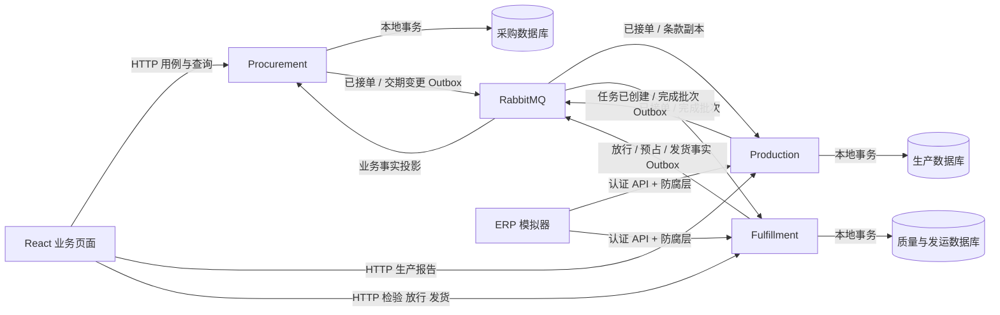

# SCM供应链协同系统：总计划

日期：2026-10-03（Asia/Shanghai）  
进度更新：2026-10-05。状态：**1A、1B、1C 已实现并完成本地验证；本轮代码等待验收、尚未提交**。74 项后端测试通过，两个服务、真实 PostgreSQL/RabbitMQ、Compose、页面查询、停机恢复及历史补建已验证；远端 CI 未运行。结果见 [1C 验证记录](docs/VALIDATION-1C.md)；1A/1B 记录保留。下一阶段为 1D 完成量上报，其余阶段及关键业务假设逐步确认。

目标是通过服装品牌与合作工厂的真实协作用例，结对学习供应链业务、DDD、分层架构和微服务。按一个可验收用例推进，每轮解释规则、实现可运行流程、验证结果，再由你完成一项小练习。阶段不是一次性生成代码的指令，也不承诺未经测试的性能或业务收益。

## 1. 最初检查结果与工作边界（2026-10-03 的历史基线）

| 对象 | 实际观察 | 对计划的影响 |
| --- | --- | --- |
| 开发目录 | `C:\Users\odane\Documents\scm-collaboration` 只有 `.git`；工作区干净；`main` 尚无提交；已配置 SCM 自己的 GitHub origin | 保留仓库配置，在此独立开发；本轮只新增本计划，不提交或推送 |
| 参考目录 | `C:\Users\odane\Downloads\Articles` 包含 `src`、`docs`、`postman`、`data`；HEAD 为 `63ee8c086a69725c9ac5dbc3e7d8f9ce0dc00721`；工作区干净 | 只读参考，不修改、不构建它；SCM 不引用其项目、配置、依赖或 Git 历史 |
| 仓库说明 | Articles 根 `readme.md` 是空文件；[架构说明](C:/Users/odane/Downloads/Articles/docs/architecture/README.md:1)明确标注课程范围与教学简化 | 以实际源码为证据；文档意图与代码事实分开记录 |
| AGENTS.md | 检查两个目录含隐藏目录的文件清单，以及 `C:\`、用户目录、Documents、Downloads 等祖先目录，未发现额外适用文件 | 遵循本会话给出的 AGENTS.md 指令；以后涉及 OpenAI API、Apps SDK 或 Codex 开发时使用 OpenAI Developer Docs MCP |
| 自动化资料 | Articles 有实际 Postman 请求集合；[Gherkin 文件](C:/Users/odane/Downloads/Articles/docs/gherkin/Review/AssignEditor.feature)为空占位；未发现测试项目；`.github/workflows` 为空 | Postman 可供手动参考；空 Gherkin 文件不能称为已实现的场景，未执行的请求不能称为已通过的测试或 CI |

开发环境通过只读命令观察：

| 工具 | 本机实际结果 | 尚未证明的事项 |
| --- | --- | --- |
| .NET | 默认 SDK `10.0.401`；另有 `10.0.202`、`9.0.318`、`8.0.406`；ASP.NET Core/.NET Runtime `10.0.12` 已安装；没有 `global.json` | SCM 包还原、编译、EF 迁移和运行 |
| Node / npm | Node `22.20.0`，npm `10.9.3`，经 Volta 提供 | React/TypeScript 工具链还原和构建 |
| Docker | Client/Engine `29.8.1`；Docker Desktop `4.93.0`；服务端可连接，使用 `desktop-linux` | 镜像拉取、Compose 启动、容器间通信 |
| Compose / WSL | Compose `5.5.1`；WSL 默认 Ubuntu、版本 2 | SCM 的完整启动与故障恢复 |
| Git | `2.47.1.windows.1` | 远端推送和 CI 执行；本轮未尝试 |
| PostgreSQL / RabbitMQ | PATH 未找到 `psql`；没有运行中的容器；发现一个其他项目已停止的 pgvector 容器及镜像；没有 RabbitMQ 镜像 | 数据库、消息代理及真实事务测试；SCM 将使用独立容器和数据卷，保留现有容器 |

上表记录设计阶段的初始检查：沙箱内首次 Docker/WSL 查询遇到访问限制，随后经获准的只读环境查询确认服务端状态。初始检查没有安装依赖或启动容器；1A 实施已还原依赖、拉取固定镜像并启动独立 PostgreSQL，详见验证记录。没有创建云资源。

## 2. Articles 架构参考：沿用、调整、暂不采用

这里的“已有实现”只表示已读到源码，不表示已运行验证。

| 主题 | Articles 的代码事实 | SCM 判断 |
| --- | --- | --- |
| Domain / Application / Persistence / API | Submission、Review 有四层项目，但 [Application 直接引用 Persistence](C:/Users/odane/Downloads/Articles/src/Services/Submission/Submission.Application/Submission.Application.csproj:21)，[Domain 引用 gRPC 契约](C:/Users/odane/Downloads/Articles/src/Services/Submission/Submission.Domain/Submission.Domain.csproj:20)；Journals 用例放在 API，服务间分层不完全统一 | **沿用分层意图，调整依赖方向**。Domain 只表达业务；Application 编排用例并定义必要端口；Persistence 实现 EF/消息适配；API 负责 HTTP、身份和组合注册 |
| 聚合、实体、值对象 | [Article 聚合](C:/Users/odane/Downloads/Articles/src/Services/Submission/Submission.Domain/Entities/Article.cs:3)有私有集合、业务行为和事件；[Submit/Approve](C:/Users/odane/Downloads/Articles/src/Services/Submission/Submission.Domain/Behaviours/Article.cs:49)包含规则；[EmailAddress.Create](C:/Users/odane/Downloads/Articles/src/Services/Submission/Submission.Domain/ValueObjects/EmailAddress.cs:12)校验值。但 Article 的 Stage 等仍可公开设置 | **沿用有意义的行为方法和值对象**；数量、工厂、版本、状态通过行为修改，关闭绕过规则的公开 setter，不给每个字段套通用类型 |
| 命令、查询与应用用例 | [Approve handler](C:/Users/odane/Downloads/Articles/src/Services/Submission/Submission.Application/Features/ApproveArticle/ApproveArticleCommandHandler.cs:11)取聚合、校验、调用行为、保存；[GetArticle query](C:/Users/odane/Downloads/Articles/src/Services/Submission/Submission.Application/Features/GetArticle/GetArticleQueryHandler.cs:8)负责读取映射 | **沿用写用例与读查询分离**；先用普通 C# 应用服务和查询对象，同库 EF 投影；不以 CQRS 为由增加数据库或 MediatR |
| EF、仓储、本地事务 | [仓储 SaveChanges](C:/Users/odane/Downloads/Articles/src/BuildingBlocks/Blocks.EntityFrameworkCore/Repositories/Repository.cs:78)就是 DbContext 保存，架构说明明确是教学选择；[事务拦截器](C:/Users/odane/Downloads/Articles/src/BuildingBlocks/Blocks.EntityFrameworkCore/Interceptors/TransactionalDispatchDomainEventsInterceptor.cs:21)共享 DbConnection 的本地事务 | **沿用 EF 映射与迁移，调整事务归属**。应用用例明确保存业务、审计、Outbox；只建需要的聚合仓储，不复制通用 CRUD/Upsert；本地事务不等于数据库与 RabbitMQ 原子提交 |
| 领域事件与集成事件 | [ArticleApproved](C:/Users/odane/Downloads/Articles/src/Services/Submission/Submission.Domain/Events/ArticleApproved.cs:3)是本地事实；[桥接 handler](C:/Users/odane/Downloads/Articles/src/Services/Submission/Submission.Application/Features/ApproveArticle/PublishIntegrationEventOnArticleApprovedHandler.cs:11)映射后发布。但 [IDomainEvent](C:/Users/odane/Downloads/Articles/src/BuildingBlocks/Blocks.Domain/IDomainEvent.cs:6)继承 MediatR/FastEndpoints 接口，[集成契约](C:/Users/odane/Downloads/Articles/src/BuildingBlocks/Articles.Integration.Contracts/Articles/ArticleApprovedForReviewEvent.cs:6)携带较宽的 [ArticleDto 图](C:/Users/odane/Downloads/Articles/src/BuildingBlocks/Articles.Integration.Contracts/Articles/Dtos/ArticleDto.cs:5) | **沿用两类事件的职责区分，调整契约**。Domain 事件不依赖发布框架；应用层在事务内生成精简 Outbox 契约，不序列化整个聚合 |
| RabbitMQ 发布与消费 | [MassTransit 注册](C:/Users/odane/Downloads/Articles/src/BuildingBlocks/Blocks.Messaging/MassTransit/DependencyInjection.cs:19)配置 RabbitMQ、扫描消费者；Submission 的 [SavedChanges 拦截器](C:/Users/odane/Downloads/Articles/src/BuildingBlocks/Blocks.EntityFrameworkCore/Interceptors/DispatchDomainEventsInterceptor.cs:8)保存后分发并直接发消息；[Review 初始化消费者](C:/Users/odane/Downloads/Articles/src/Services/Review/Review.Application/Features/Articles/InitializeFromSubmission/ArticleApprovedForReviewConsumer.cs:24)检查不存在再插入，注释明确讨论 Inbox 的简化 | **沿用事件协作，补齐基础可靠性**。所查源码未发现持久 Outbox/Inbox 或数据库并发令牌；先查再插入及重复时抛错不满足 SCM 安全重投要求 |
| 状态转换 | [状态机](C:/Users/odane/Downloads/Articles/src/Services/Submission/Submission.Application/StateMachines/ArticleStateMachine.cs:7)读取缓存转换表并用 Stateless 校验；源码 TODO 提议移回 Domain、移除库；[AssignAuthor/Submit](C:/Users/odane/Downloads/Articles/src/Services/Submission/Submission.Domain/Behaviours/Article.cs:30)仍有状态限制、事件补充 TODO | **沿用显式转换规则，暂不采用通用状态表/引擎**。订单、生产、质量、发货分开建模，先通过业务方法和规则测试表达 |
| 操作与审计 | [SetStage/AddAction](C:/Users/odane/Downloads/Articles/src/Services/Submission/Submission.Domain/Behaviours/Article.cs:9)记录 StageHistory、ArticleAction；[Timeline handler](C:/Users/odane/Downloads/Articles/src/Modules/ArticleTimeline/ArticleTimeline.Application/ArticleTimeline.Application/EventHandlers/AddTimelineEventHandler.cs:22)包含模板化时间线和共享事务代码 | **沿用业务操作记录**。SCM 以本服务同事务的追加审计为准；不复制跨业务模板模块，不把已有时间线当成全面审计或 Event Sourcing |
| 身份与权限 | [JWT 配置](C:/Users/odane/Downloads/Articles/src/BuildingBlocks/Articles.Security/ConfigureAuthentication.cs:19)有真实 bearer 校验，但关闭 audience 校验；[端点角色限制](C:/Users/odane/Downloads/Articles/src/Services/Submission/Submission.API/Endpoints/ApproveArticleEndpoint.cs:15)结合 [资源访问检查](C:/Users/odane/Downloads/Articles/src/Services/Submission/Submission.Application/ArticleAccessChecker.cs:8) | **沿用服务端身份、角色、资源归属校验**。重新实现工厂隔离，校验签名、issuer、audience、有效期；角色许可与 FactoryId 归属必须同时成立 |
| 履约读模型参考 | ArticleHub 有 PostgreSQL/Hasura 注册和两个实际消费者；[Accepted consumer](C:/Users/odane/Downloads/Articles/src/Services/ArticleHub/ArticleHub.API/Articles/Consumers/ArticleAcceptedForProductionConsumer.cs:20)假定前置文章已到达后覆盖字段；[搜索端点](C:/Users/odane/Downloads/Articles/src/Services/ArticleHub/ArticleHub.API/Articles/SearchArticles/SearchArticlesEndpoint.cs:11)调用 GraphQL | **沿用事件更新读模型，调整所有权与顺序保护**。总览放 Procurement，按业务事实、源版本去重更新，缺少前置数据时等待，不直接查询其他数据库 |
| BuildingBlocks | `Blocks.*` 提供事件、仓储、HTTP、安全等共性；`Articles.*` 同时共享业务枚举、行动接口、gRPC 与 DTO。Review 的 [Domain 引用集成契约](C:/Users/odane/Downloads/Articles/src/Services/Review/Review.Domain/Review.Domain.csproj:18)，[FromSubmission](C:/Users/odane/Downloads/Articles/src/Services/Review/Review.Domain/Articles/Behaviors/Article.cs:153)直接接收外部 DTO | **保留最小技术共性，调整业务边界**。契约归发布服务所有，接收方经防腐层转换；不共享业务实体、状态枚举或一个万能领域模型 |

参考的完成程度需单独说明：

- **实际源码**：Submission → Review 的发布/消费、ArticleHub 的 Approved/Accepted 投影、业务行为、EF 映射和 JWT 授权均有代码。
- **教学简化**：仓储兼任保存入口、多个 API 风格、宽 DTO、后保存发布与简化重复检查，均不能直接充当 SCM 的可靠性实现。
- **未完成迹象**：业务方法和状态机有明确 TODO；Production 在 [Compose 中被注释](C:/Users/odane/Downloads/Articles/src/docker-compose.yml:51)，其目录未找到跨服务消费者，不据此宣称整条投稿到出版链路已打通。
- **文档规划**：[ArticleHub 规格](C:/Users/odane/Downloads/Articles/docs/ArticleHub_Specification.md:39)描述 Submitted/Reviewed/Published、订阅、重试及读写比等目标；本轮不能将其视为运行能力或实测指标。也未找到健康检查/OpenTelemetry 注册，已有 CorrelationId 日志只说明部分可观测性实现。

## 3. 建议的首版业务范围

采用你给出的基线：一个品牌、至少两家工厂；一个采购订单只分配一家工厂，包含多个款式/颜色/尺码明细；数量为正整数，单位为件。预置少量工厂与商品，订单提交时保存商品说明快照，后续基础资料变化不改写历史内容。

主流程：**创建订单 → 提交指定版本 → 工厂接受/拒绝 → 自动建立生产任务 → 按明细报告新增完成量/延期 → 批次检验 → 品牌放行 → 分批发货 → 查询履约**。

首版学习项目的最终范围包含双方确认交期变更、轻量 ERP 模拟接入、基础故障恢复。阶段 1 只到完成量与页面查询；质量/发运、变更/ERP 分别在阶段 2、3加入。

明确排除面辅料采购/领料、BOM、MRP、自动排产、产能优化、完整库存仓储运输、收货、结算、付款和退货。接单后的数量减少、取消、更换工厂，以及报告更正、返工、放行撤销、已发货撤回，要先明确在制/放行/预占/发货影响，再作为扩展实现。

| 人员 | 允许的核心业务行为 |
| --- | --- |
| 品牌采购/供应链人员 | 创建、提交及接单前撤回订单；协商交期；查看全部合作订单和履约总览 |
| 工厂人员 | 仅访问已提交给所属工厂的版本及其后续数据，品牌草稿不对工厂开放；对指定版本接受/拒绝；报告生产、延期、检验；准备与确认实际发货 |
| 品牌质量人员 | 查看检验、隔离原因；确认品牌放行；不能由工厂或 ERP 凭证代行 |

### 业务术语

| 术语 | 首版含义 |
| --- | --- |
| 商品组合 / SKU | 款式、颜色、尺码的组合；不是物料或 BOM |
| 采购订单 / OrderLine | 品牌对一家工厂的成衣采购承诺及明细；同一订单的重复 SKU 默认禁止 |
| 提交版本 / OrderVersion | 每次正式提交生成的不可变内容快照；工厂决定必须指向该版本 |
| 并发修订号 / Revision | 每次聚合修改递增的技术冲突检测号；与提交版本分开 |
| 交期条款修订 / TermsRevision | 双方确认后生效的交期变更序号；不改写原提交快照或订购量 |
| 生产任务 | 接单后，Production 按确认订单自动建立的任务；不是自动排产 |
| 完成报告 / ReportNo | 一次新增成品的事实及稳定业务编号；裁剪、缝制百分比不增加完成量 |
| 完成批次 / BatchId | 与工厂、订单版本、订单明细关联的一批已报告成品，作为检验和发货的依据 |
| 检验结果 | 工厂提交的整批检验结论；通过与不通过均不同于品牌放行 |
| 品牌放行 / Release | 品牌质量人员授权一部分或全部合格批次可供发货 |
| 预占 / Reservation | 发货单准备时锁定一份可发量；仍未实际发货，取消准备则释放 |
| 发货 / Dispatch | 工厂确认货物已发出的业务事实；不表示品牌收货或验收 |
| 履约总览 | 按明细展示订购、完成、隔离、放行、预占、已发货和缺口；读模型不驱动其他服务 |

## 4. 候选服务边界与数据归属

建议保留三个业务服务。质量与发运虽有不同业务行为，但共同控制“可发数量”，放在同一数据库可用本地事务维护该约束。当前没有增加第四个业务服务的明确需求。

| 限界上下文 / 服务 | 权威数据与职责 | 可保存的下游/只读数据 |
| --- | --- | --- |
| Procurement / 采购协同 | 订单、明细、提交快照、接受/拒绝、交期变更；首版工厂/商品预置资料；订单确认的最终判断权 | Production、Fulfillment 的事实投影；不替它们执行状态变化 |
| Production / 生产协同 | 任务、明细完成余额、报告编号与内容、完成批次、延期；完成量的最终判断权 | 被接受的订单版本、工厂、明细、订购上限与生效交期的本地契约副本 |
| Fulfillment / 质量与发运 | 完成批次引用、检验、隔离、品牌放行、数量账、预占、发货单；放行与发货的最终判断权 | 已接单内容及 Production 的不可变完成事实；副本缺失时不允许相关操作 |
| ERP Simulator / 独立演示进程 | 模拟外部编码、报告编号、累计/增量数据及失败重试，不拥有 SCM 业务状态 | 只调用所属工厂获准的服务 API；不读写服务数据库，不计入业务服务数量 |

本地可共用一个 PostgreSQL 实例，但采用 `scm_procurement`、`scm_production`、`scm_fulfillment` 三个数据库、独立账号和迁移。各账号只访问所属数据库；没有跨库关联、查询或修改。产品/工厂与订单快照通过契约传递，各服务不共享业务实体。

上下文关系为上游发布业务事实、下游通过防腐层转换。Procurement 为已接单订单提供公开事件语言；Production 为完成事实的上游；Fulfillment 为放行/发货事实的上游；Procurement 的总览是其下游读模型。

### 战术设计候选，随用例落实

| 聚合 / 模型 | 行为与必须保证的边界 |
| --- | --- |
| PurchaseOrder；OrderLine 实体；提交快照 | `AddLine`、`Submit`、`WithdrawSubmission`、`AcceptVersion`、`RejectVersion`；只能决定当前待确认版本，接单后工厂/SKU/数量固定 |
| 订单内交期变更记录 | `ProposeDeliveryDateChange`、`ConfirmDeliveryDateChange`、`RejectDeliveryDateChange`；提议不生效，另一方确认才生效，同时递增 TermsRevision |
| ProductionTask；任务明细；不可变完成报告/批次 | `RecordCompletion`、`ReportDelay`；有效完成量不超接单量，同业务编号同内容返回原结果，异内容冲突 |
| QualityBatch | `SubmitInspection`、`Quarantine`、`ReleaseByBrand`；未检验/不合格不可放行，每次放行有独立事实编号，累计不超过该批次完成量 |
| FulfillmentLine 数量账；Shipment 发货单 | `ReserveForShipment`、`ConfirmDispatch`、`CancelPreparation`；跨明细/批次发货在一个本地事务中更新数量账、发货单、审计及 Outbox |
| 值对象 | 商品组合、正整数件数、订单版本、业务报告编号等真正有规则的值；身份和时间由应用边界提供 |

Domain 不依赖 EF、RabbitMQ、HTTP、gRPC、ERP DTO 或 MediatR/FastEndpoints。应用层做身份归属检查、幂等处理、加载聚合和事务编排；领域行为表达业务约束；基础设施负责数据库、锁、发布/消费和外部适配。跨聚合的发货协调留在同一服务的本地事务内，并解释这一有意的边界选择。

审计记录业务编号、已验证操作者、工厂、目标版本、前后事实、原因和 UTC 时间，与业务同时提交；技术日志记录请求、TraceId、异常及重试，不替代审计。历史报告、快照和日志按需读取，避免每次加载全部历史。

## 5. 先明确规则，再落实状态机与一致性

### 订单版本与状态

默认草案：草稿可修改；提交后快照冻结。待确认订单要修改时先撤回该提交，再编辑并提交新版本；拒绝须有原因，允许基于旧内容建立新草稿并重提。接受、拒绝、撤回都携带 OrderVersion 与 Revision，在采购数据库中竞争同一聚合修订号。

因此“接受”和“撤回后修改”同时发生时只有一个操作提交成功，另一方得到明确并发冲突；旧页面不能接受已撤回/被替代的版本。接单后禁止通过 setter 或通用更新接口修改工厂、SKU 和数量。交期申请可由品牌或工厂提出，由另一方确认；默认同一订单最多一个待确认申请，保留原因及前后日期，已发生的发货事实与当时适用交期不被回溯改写。

| 业务维度 | 状态 / 事实表达 |
| --- | --- |
| 订单确认 | 草稿 → 待工厂确认 → 已接受 / 已拒绝 / 已撤回；拒绝/撤回版本留档，新提交生成新版本 |
| 生产 | 任务已建立；按各明细有效完成量计算未开始/部分完成/全部完成；延期是独立报告，不自动改交期 |
| 质量 | 批次待检验 → 检验通过 / 不合格隔离；放行用数量事实单独表达，检验通过并非自动放行 |
| 发货 | 准备中（已预占）→ 已发货，或准备中 → 已取消（释放预占）；已发货不能首版直接撤回 |
| 履约 | 按各明细已发货与订购量计算未发货/部分发货/全部发货；生产完成、放行完成都不等于履约完成 |

逾期根据生效交期、当前业务日期和剩余发货量计算。事件时间使用 UTC；交期默认按 Asia/Shanghai 的日期解释。

### 数量约束与重要默认规则

对每个已接受订单明细，定义 Q=确认订购量、C=有效完成量、R=累计放行量、S=累计已发货量、P=当前预占量：

**0 ≤ S + P ≤ R ≤ C ≤ Q；可供新预占量 = R − S − P。**

批次也要维护自己的完成、放行、预占、发货约束，不能用其他批次的放行替代本批次；不合格隔离批次的 R、S、P 均为零。计数采用足够范围的整数并检查溢出。

- 一次完成报告默认只对应一个明细，形成一个完成批次，表示本次新增数量。工序进度作为描述信息，不累加成品；确认后不能覆盖或提交负数冲销。
- **待确认的业务解释**：C 表示已确认、未撤销的成品报告之和，包含后来检验不合格的数量，不等于合格量。首版没有返工/报废更正机制，出现不合格会留下可发缺口，不允许再生产一批而绕过 C≤Q。需要补做时先设计有效量调整和更正流程。
- 首版按整批提交通过/不通过结论，可记录抽检说明，但不实现 AQL 自动判断、混合合格量或复检。需要不同结论时先拆成独立批次；通过的批次允许品牌分次放行。
- 发货准备即预占；确认实际发出将同一份 P 转成 S；取消准备只释放一次。预占无自动失效时间，首版由工厂显式取消，页面可见。
- 同一订单发货单可以分配多个批次/明细，但只能属于同一家工厂和已接单版本；数据版本、归属、批次放行都满足后才允许准备或发货。

### 本地事务与并发保护

| 约束 | 计划中的数据库与应用保护 |
| --- | --- |
| 接单与修改互斥 | PurchaseOrder 的显式 Revision 作为 EF 并发令牌；所有相关命令都推进根修订号，明细变更也不能绕过；冲突返回 409、提示刷新，不自动接受新内容 |
| 并发生产不超量 | 在 Production 内锁定任务数量保护行/校验修订号，追加报告、批次、更新数量和 Outbox 同事务；使用唯一业务键及行内 CHECK；冲突重读后重新校验 |
| 并发预占/发货不超量 | Fulfillment 同事务按固定顺序锁定明细数量账及涉及批次，再执行领域行为；原子更新数量、发货单、审计、Outbox；多明细操作全部成功或全部回滚 |
| 幂等不依赖先查再插入 | 唯一键是并发仲裁者；保存规范化输入摘要及原结果，唯一冲突后读取已提交结果并比较内容；同编号异内容报告冲突 |
| 工厂隔离 | 依据已验证身份中的工厂归属限制读取与写入；FactoryId 由服务端确定；枚举列表、详情、报表、ERP 入口、后台用例都覆盖隔离测试 |

行内 CHECK 保护计数上下界，不能单独保证多行汇总；数量保护行、事务和锁共同处理跨批次约束。选用的技术依据为 [EF 乐观并发文档](https://learn.microsoft.com/en-us/ef/core/saving/concurrency)与 [PostgreSQL 行锁文档](https://www.postgresql.org/docs/current/explicit-locking.html)，实际行为将在真实 PostgreSQL 验证。

首版认证用少量预置品牌/工厂人员及工厂技术凭证。演示认证模块暂挂 Procurement 的开发环境 API：验证凭证后签发短期令牌，三个服务各自验证签名、issuer、audience、有效期及授权范围；密钥经本地环境配置提供。登录界面选择身份不等于授权，ERP 凭证没有品牌放行权限。账号注册、复杂组织管理与独立认证服务后续完善。

## 6. 跨服务协作与基础可靠性

### 领域事件与集成契约

领域事件是上下文内部事实，例如 `OrderVersionAccepted`、`CompletionRecorded`、`InspectionSubmitted`、`BatchReleased`、`ShipmentDispatched`。应用层将需要公开的事实转换为独立集成事件；内部事件类不直接成为消息 DTO。

集成信封至少包含 EventId/MessageId、EventType、ContractVersion、FactId（稳定业务事实编号）、OrderId、AcceptedOrderVersion（适用时）、FactoryId、OccurredAtUtc、来源服务/来源修订号、CorrelationId、CausationId、TraceParent。提交事件用 SubmittedOrderVersion，不能把它误称为 AcceptedOrderVersion。消费者按来源及业务流解释修订号，不比较不同服务的序号，也不以发生时间作为覆盖优先级。

已接单事件仅携带创建任务/履约数量账所需的订单、明细、工厂、数量上限、商品快照和交期；完成批次事件携带批次、明细、新增数量和报告业务编号；放行/发货事件携带具体事实及数量分配，不发送整个聚合或无关人员资料。

| 流程 | 同步/异步与原因 | 最终判断权、前置条件与用户反馈 |
| --- | --- | --- |
| 创建、提交、接受/拒绝订单 | HTTP 同步提交采购本地事务 | Procurement 判断版本、归属、并发；接单成功仅表示订单已接受，页面显示“生产任务建立中” |
| 已接单 → 建立生产任务 | RabbitMQ 异步，任务服务暂时不可用不撤销已完成的接单事实 | Production 验证契约，唯一业务键 `(OrderId, AcceptedOrderVersion)` 建立一次；发出 `ProductionTaskCreated` 事实，采购投影收到后才显示任务已建立 |
| 已接单 → 建立履约数量账 | RabbitMQ 异步，复制确认上限 | Fulfillment 必须收到明确已接单版本，不能靠前端传参或缺省零/无限上限创建可发量 |
| 完成报告 → 批次/总览 | HTTP 同步在 Production 保存；完成事实异步到 Fulfillment 和 Procurement | Production 决定完成事实，Fulfillment 决定后续检验/放行；批次未同步到达时提示等待，不允许检验、放行、预占或发货 |
| 检验 → 放行 → 准备/确认发货 | Fulfillment 的独立 HTTP 用例，使用本地事务 | 检验通过、品牌授权及数量约束必须明确成立；ERP 请求走相同用例，不能跳过放行 |
| 检验/隔离、放行、预占、发货 → 总览 | RabbitMQ 异步，只读汇总允许最终一致 | Procurement 以稳定 FactId 去重累计；展示各事实的更新时间和“同步中”，不能用总览的旧数量批准发货 |
| 双方确认交期 → 下游条款 | Procurement 同步确认，事件异步传播 | 只有双方确认后的 TermsRevision 生效；下游只更新较新的交期条款，不覆盖订单数量或接受版本 |
| ERP 入站 | 首版优先认证 HTTP，以明确返回结果和校验错误；服务间仍用事件 | 所属业务服务校验映射、归属、数量与状态；需要前置事实的请求明确返回待同步/冲突，不能把“请求已接收”显示为业务成功 |

### 从第一条跨服务消息就实现

1. **可靠发送**：业务数据、审计、Outbox 同一本地事务保存。发布前建立所有预期订阅队列及绑定，下游离线仍保留消息；后台发布器发送持久消息到持久交换机/队列，处理 publisher confirm、失败和不可路由返回，确认后才标记已发送。确认后进程崩溃会重发同一 MessageId，由消费幂等吸收重复。单服务初版一个发布 worker，不提前建设消息平台。
2. **可靠消费**：业务变更、Inbox 成功记录、必要审计及后续 Outbox 同事务保存，提交后才 ack。`UNIQUE(ConsumerName, MessageId)` 仲裁重复消费；失败回滚，重投重新执行，重复成功消息安全返回原结果。同 MessageId 异内容进入错误处理，不当作成功重复。
3. **三种幂等分别处理**：HTTP 使用 `(Subject, Operation, IdempotencyKey)` 与内容摘要/原结果；消息使用 Inbox；生产/ERP 等业务报告使用 `(FactoryId, SourceSystem, ReportType, ReportNo)` 唯一键及规范化内容。不同 MessageId、不同 HTTP 重试键也不能让同一业务报告重复计数。
4. **前置缺失与乱序**：一旦用例需要依赖其他事实，持久保存待处理消息及 Pending 状态，提交后可 ack，由后台在前置到达后恢复；业务成功与 Inbox Processed 必须同事务完成。重复消息不能把 Pending 错认成已完成。批次先于接单数据到达就等待；旧 TermsRevision 不覆盖新交期；同 FactId 异内容记录冲突。
5. **可恢复失败**：首版就保存尝试次数、下一次处理时间、最后错误，发布/消费者启动时扫描恢复，避免紧密重试。进阶退避、失败队列、受权限限制的人工重放与监控在阶段 4完善；永久无效消息不无限重投，也不能静默丢弃。没有业务需求时不引入 Saga。

RabbitMQ 客户端自动重连不会替应用持久保存未发送消息，因此 Outbox 与确认机制必须同时存在；依据 [RabbitMQ .NET 客户端指南](https://www.rabbitmq.com/client-libraries/dotnet-api-guide)。发送确认只说明 broker 接收，不能证明 Production/Fulfillment 业务已完成。

### 必须通过的故障与异常演示（以下均为计划，尚未执行）

| 场景 | 验收标准 |
| --- | --- |
| 数据库已提交后 broker 不可用 | 业务事实与 Outbox 留存；恢复后完成发布和下游处理 |
| 消费中抛错/提交后 ack 前崩溃 | 未提交业务回滚；已提交业务重投不重复累计 |
| 新 MessageId 包装同一 ReportNo | 相同内容返回原结果；异内容冲突；完成量只增加一次 |
| 两次并发生产/预占/发货 | 在真实 PostgreSQL 中不能突破 C≤Q 或 S+P≤R；失败有明确业务或并发结果 |
| 未放行、隔离、前置事件未到 | 服务端拒绝相关发运操作；前置等待恢复后继续 |
| 接单与撤回修改同时发生、旧交期消息迟到 | 一个采购修订成功；旧版本拒绝，旧条款不覆盖新条款 |
| 工厂 B 访问工厂 A 数据 | 列表不泄露，详情/写入/ERP 操作不越权；401 与 403/资源不可见语义在 API 约定中统一 |

可用教学算例：某明细 Q=100，C=60，R=40；准备发货 25 件后 P=25，可再预占 15 件，另一请求预占 20 件须失败；确认实际发货后 S=25、P=0。这里是规则算例，不是测试结果或性能指标。

## 7. 技术与版本选择

### 已核实的官方信息与待验证兼容性

| 项目 | 2026-10-03 核实结果 / 建议 | SCM 实际验证状态 |
| --- | --- | --- |
| .NET / ASP.NET Core | .NET 10 为当前受支持 LTS，官方当前运行时补丁 `10.0.12`，支持期到 2028年11月；固定 SDK `10.0.401`。[支持政策](https://dotnet.microsoft.com/en-us/platform/support/policy/dotnet-core) | 1A 后端构建与测试通过 |
| EF Core | EF 相关包统一 `10.0.12`，包括 Relational；工具也固定该版本。[版本计划](https://learn.microsoft.com/en-us/ef/core/what-is-new/)、[包元数据](https://www.nuget.org/packages/Microsoft.EntityFrameworkCore/10.0.12) | 已还原、生成/应用迁移，真实事务与约束测试通过 |
| Npgsql EF Provider | 固定 `10.0.3`；声明 EF Core/Relational `>=10.0.4 && <11.0.0`，与 EF `10.0.12` 相容。[包元数据](https://www.nuget.org/packages/Npgsql.EntityFrameworkCore.PostgreSQL/10.0.3)、[发布说明](https://www.npgsql.org/efcore/release-notes/10.0.html) | 实际还原、构建与 PostgreSQL 组合测试通过 |
| PostgreSQL | 固定 `18.6-bookworm` 及 digest，使用独立 SCM 容器；原 pgvector 项目保持不变。[版本政策](https://www.postgresql.org/support/versioning/) | 镜像拉取、迁移、数据库唯一约束/并发/回滚已验证 |
| RabbitMQ | 官网列 `4.3.6` 为当前 4.3 补丁，作为候选；实施时复核社区支持窗口并安排升级。[发布与支持信息](https://www.rabbitmq.com/release-information) | 镜像与 .NET 客户端组合、消息恢复待验证 |
| React / TypeScript | 固定 React `19.3.0`、TypeScript `7.0.2`、Vite `8.3.2`，通过 npm 元数据重新核实并生成锁文件。[React 版本](https://react.dev/versions) | 类型检查、构建及浏览器正常/异常流程通过 |
| Node | 使用本机及 CI 固定的 `22.20.0`。[Node 发布](https://nodejs.org/en/about/previous-releases)、[Vite 要求](https://vite.dev/guide/) | 前端实际构建通过 |

1A 的已配置版本以 global.json、Directory.Packages.props、工具清单、锁文件及 compose.yaml 为准，验证记录区分元数据和实际运行。1C 已固定 RabbitMQ/官方客户端并验证消息通信与恢复，见 1C 验证记录；其余后续组件仍是候选，每阶段重新核实。

复现要求随首个相关用例落地：`global.json` 固定 SDK 与明确 roll-forward 策略；一个根 `Directory.Packages.props` 固定包版本，必要时锁定传递依赖；工具清单固定 `dotnet-ef`；前端提交 `package-lock.json`、记录 Node/npm 版本，CI 使用 `npm ci`；Compose 镜像固定具体版本并记录 digest，不使用漂移的 `latest`。三个数据库独立迁移，本地迁移命令与演示数据可重复执行，不能清空用户现有数据库。

### 逐项组件判断

Articles 的 [集中版本](C:/Users/odane/Downloads/Articles/src/Directory.Packages.props:19)以 .NET/EF 9 为主，包含多个教学组件；[Compose](C:/Users/odane/Downloads/Articles/src/docker-compose.yml:59)同时使用 SQL Server、Redis、PostgreSQL、MongoDB 等，部分镜像未固定版本。SCM 重新选择：

| 组件 / 做法 | 首版决定及理由 |
| --- | --- |
| ASP.NET Core API | 三个服务统一使用 ASP.NET Core Controller API（`ControllerBase` + `[ApiController]`），按业务资源组织路由、按用例编写 action；统一验证、授权、ProblemDetails 与 OpenAPI |
| CQRS / MediatR | 保留命令与查询的职责区分，普通应用服务即可；暂不采用 MediatR，真正需要统一管道时再评估兼容性与许可 |
| RabbitMQ / MassTransit | RabbitMQ 必选；首版倾向官方 RabbitMQ.Client + 小规模 Outbox/Inbox worker，便于直接学习提交/确认/重投；暂不照搬 MassTransit `8.5.2`，若转用须评估当前版本、许可、EF 10 Outbox 能力和减少代码的实际收益 |
| Carter / FastEndpoints | 暂不采用，避免为同一 HTTP 用例引入多套约定 |
| gRPC | 暂不采用；目前服务间业务事实异步协作，ERP/页面用 HTTP；以后有明确同步边界和测量依据再讨论 |
| Hasura / GraphQL | 暂不采用；Procurement 的 EF 只读投影和 HTTP 查询足够支持总览 |
| Redis | 暂不采用；PostgreSQL 已承担权威数据、幂等和数量保护，不另建缓存/锁组件 |
| 网关 / 服务发现 | 暂不建独立服务；开发前端代理、Compose DNS 和静态服务配置足够；对外入口随部署方案选择 |
| BuildingBlocks | 初始不搭大框架；确有重复时抽取少量事件元数据、身份上下文和可靠消息基础设施；不共享业务实体或业务判断 |
| OpenAPI / 日志 / 健康检查 / 追踪 | 采用 ASP.NET Core OpenAPI、ILogger JSON 日志、存活/就绪检查；从首次跨服务协作传播 TraceParent/关联信息，必要 OpenTelemetry 链路逐步加入；完整仪表盘按故障定位需求建设 |
| Saga / 工作流引擎 | 暂不采用；本地事务与不可变事实可覆盖当前规则，有补偿业务需求后再设计 |

Controller API 便于结对学习时识别 HTTP 入口：Controller 负责绑定请求、入口授权、调用应用用例及返回结果；Application 编排领域行为与持久化事务；Domain 保证业务规则；Persistence 实现数据库访问。Controller 保持精简，领域层仍不依赖 HTTP 或数据库。选择 Controller 不改变三个服务边界、事件协作和数量一致性方案，也不要求引入 MediatR。

### 前端简化原则

前端以操作和验证业务流程为目标，开发重点放在供应链规则、DDD 和后端可靠性。

- 保留 React + TypeScript + Vite。优先使用原生表单、表格、少量 CSS、React 自带状态和 `fetch`，按实际需要增加依赖。
- 页面从登录、订单列表、订单创建表单和订单详情开始；生产、质量、发货及履约逐步放入订单详情的业务区块，按角色显示操作。
- 以明细表展示订购、完成、隔离、放行、预占和已发货数量；首版不建设独立仪表盘、图表系统、动画、主题系统或通用后台框架。
- 保留字段标签、键盘操作、加载/提交状态、明确错误、并发冲突提示和“同步中”反馈。重试沿用原请求/报告编号；业务状态和权限以服务端结果为准。
- ERP 映射、错误记录与人工处理使用简单列表和表单；技术故障演练主要通过脚本、OpenAPI 和日志完成。
- 随用例补齐界面，复用已有表单和表格；每轮只展示有学习价值的代码改动与必要解释，重复内容通过文件链接查阅。

## 8. 分阶段开发与结对验收

每个小迭代都先讲一个业务问题，再给可运行的服务/API/页面和测试，不把目录、接口或伪实现当成完成。先建本次用例需要的项目；阶段 2 才随质量用例加入 Fulfillment。常规实现细节自行决定并解释；范围变化、较大边界调整和外部资源使用先讨论。

| 阶段 / 小迭代 | 可运行结果与验收重点 | 你的动手任务示例 |
| --- | --- | --- |
| **0：本轮设计确认** | Articles 对照、术语、范围、数据归属、规则和版本候选；本计划已编写，末尾假设仍待确认。下一轮先用一个订单算例复核规则 | 用两个 SKU 和一家工厂填写一份订单，并按本计划说明何时能修改 |
| **1A：创建订单草稿** | 只实现 Procurement 的创建/查看用例和最小 React 登录、订单表单及列表/详情；真实身份、工厂可见性、PostgreSQL 迁移/预置资料；固定版本；从这里建立构建/领域测试/前端检查 CI。[1A 详细计划](C:/Users/odane/Documents/scm-collaboration/PLAN-1A.md) | 为“同单重复 SKU”增加一个有意义的规则测试或实现该校验 |
| **1B：提交与工厂决定（已实现、本地已验证）** | 草稿编辑与 Revision 并发保护；不可变版本、接受/拒绝/撤回、审计；同版本重复决定与冲突语义；真实 PostgreSQL 验证接受与撤回/修改竞争、工厂隔离。[1B 详细计划](C:/Users/odane/Documents/scm-collaboration/PLAN-1B.md) | 补“恰好 500 字符原因可以拒绝”的边界测试 |
| **1C：自动建立生产任务（已实现、本地已验证）** | 加入 Production；第一条跨服务事件即具备事务 Outbox、可靠发布、Inbox、唯一任务键及任务已创建回执；页面区分已接单与任务建立中；受控补建历史已接单订单。[1C 详细计划](PLAN-1C.md) | 主动停 broker，观察接单事实仍保存；恢复后核对只有一个任务 |
| **1D：报告新增完成量** | 按明细生成批次与完成计数，报告业务幂等、并发上限、只读总览事件；页面查看部分完成；完善 Compose 启动与 CI 中真实数据库/消息测试 | 用相同 ReportNo 换 MessageId 重投，再更改数量，解释两种结果 |
| **2A：批次检验与品牌放行** | 加入 Fulfillment；消费接单/批次事实，前置乱序等待；工厂检验、隔离、品牌分次放行，权限及未放行不能发货测试 | 为“工厂或 ERP 不能执行品牌放行”增加验证场景 |
| **2B：预占与分批发货** | 准备、取消、确认实际发货；明细与批次数量账同事务；并发/重复发货、释放预占、越权测试；页面呈现已放行、待发、已发的区别 | 按 Q=100 的算例测试剩余量，并取消一张准备单验证释放一次 |
| **2C：履约查询闭环** | 完善检验/隔离、放行、预占、发货事实投影；复用订单详情，按明细展示缺口、更新时间、同步状态；全流程页面演示 | 判断一个“全部生产完成但只发货一部分”的订单为何尚未履约 |
| **3A：交期协商** | 双方确认、拒绝、原因、条款修订和审计；旧交期消息不覆盖新条款；延期报告不自行变更承诺 | 为“提议未确认时交期保持原值”增加规则测试 |
| **3B：ERP 模拟接入** | 独立 C# 演示进程，经 HTTP/防腐层做外部订单/SKU映射、增量/累计转换、重复与冲突处理；未知编码、迟到、失败重试和人工处理入口 | 给工厂 B 添加一个外部 SKU 映射，演示未知编码修复后的重试 |
| **4A：故障与运维** | 精确注入发布、消费、数据库、下游停机故障；退避、失败处理、人工重放、必要追踪；恢复演练及备份/迁移/排障手册 | 按手册定位一条失败消息并重放，说明为什么不会重复计数 |
| **4B：演示与部署方案** | 一条正常流程及至少三条异常流程；文档/测试记录整理；AWS 部署方案、资源清单、权限与网络、密钥、迁移/回滚/备份设计 | 选择一个异常演示，独立复现并记录恢复步骤 |

每轮交付固定包含：业务规则与取舍、关键代码位置、启动/迁移方式、验证步骤、真实执行结果和剩余问题，以及一项适合你亲手完成的小任务。后续测试记录带日期、环境、命令、退出码、测试范围；未运行的检查标记“待执行”，预期结果不写成已通过。

领域单元测试逐步覆盖非法状态和数量规则；事务、唯一约束、锁、并发、回滚与消息恢复使用真实 PostgreSQL/RabbitMQ，不能用 EF 内存数据库替代证明。CI 随用例扩展，最终包括后端构建/测试、前端类型检查/构建、关键集成测试和容器构建。

### ERP 阶段的具体边界

- 外部订单号与商品编码按 `(FactoryId, SourceSystem, ExternalCode)` 映射到内部订单/稳定 LineId/SKU；映射存于所属服务的接入模块，随必要契约传递，不跨库查询，也不建通用集成平台。
- 外部 DTO/状态先经防腐层转换，再进入与页面共用的业务用例。原始业务编号、标准化内容、接收时间、错误分类和处理状态留存；凭证不写入日志。未知订单/SKU 进入可见错误记录，由品牌采购维护映射后人工重试。
- **增量与累计显式声明**：普通生产 API 用正增量；累计 ERP 流按工厂、来源、订单版本、明细及明确批次/计数口径维护水位。只将“新累计值 − 已确认累计值”转换为新增量，差额为零不创建完成批次；更新水位、稳定业务编号、完成事实和 Outbox 必须同事务。
- 外部较旧序号不覆盖新水位；相同序号/报告号同内容幂等返回，异内容冲突；新序号的累计值下降进入更正待处理，不自动负数冲销。增量报告迟到时仍检查接单版本、编号、归属和数量上限，时间晚不代表可忽略规则。
- 累计水位限定同一计数口径，不能把不同来源累计相加；首版同一批次不同时手工和 ERP 混报。若累计流没有真实批次标识，转换出的增量批次需明确标为系统派生，质检/出货必须引用返回的内部批次映射，不能凭外部累计总量放行或发货。
- ERP 发货仍执行预占与确认用例；质检数据仍只形成检验记录。模拟器演示失败、延迟、重复、未知映射和安全重试，不能凭外部“已出货”状态绕过可发量校验。更正、返工及与手工数据混用先补规则。

### 最终交付与 AWS 边界

最终交付可运行的三个服务、React 前端及 ERP 模拟器；独立数据库迁移与演示数据；Compose/启动说明；业务流程图、上下文图、架构图；API/事件契约、关键决策；自动化测试及实际记录；正常/异常演示；运维手册；AWS 部署方案与资源清单。

AWS 阶段再比较教学演示的 EC2/Compose 方案与 ECS、RDS PostgreSQL、RabbitMQ 托管/自管等方案，明确区域、版本支持、资源、权限、网络、密钥、日志、备份和成本来源。未经明确授权不创建付费资源，不先估造费用或收益。每份文档持续区分“已实现”“已验证”“后续计划”。

## 9. 开始实现前，需要确认的五项假设

以下记录影响模型的业务选择；接单前版本流程已于 2026-10-04 确认，其他尚未确认的部分仍保留。可以按 A–E 回答“同意默认”或写需要修改的部分；1B 的具体确认记录见详细计划。

| 编号 | 建议默认方案 | 需要确认的业务含义 |
| --- | --- | --- |
| **A：基线范围** | 一个品牌、至少两家工厂；一单一厂、多 SKU、件数正整数；同单同 SKU 只出现一行；只有订单级交期；品牌草稿不对工厂开放；按发货衡量履约；排除第 3节所列业务 | 是否接受这些基线，包括暂不支持明细独立交期、单价/金额/结算？ |
| **B：版本与交期** | 提交快照冻结；待确认要改先撤回再重提，拒绝后可重提；接受与撤回竞争同一修订号；接单后只通过双方确认改交期，一次一个申请，不回溯改写已发货事实 | 接单前修改与重提流程已确认；接单后的交期协商规则留到 3A 复核 |
| **C：完成与质量** | 一次报告一个明细/一个批次；整批通过或隔离，通过后可分次放行；不合格仍计已确认完成量，首版不能自动补做、复检、返工或冲销 | 是否接受不合格会形成履约缺口，需要后续更正/返工用例才能补足？ |
| **D：发货与预占** | 工厂准备发货即预占，确认实际发出才计履约；取消准备释放；无自动超时；允许同单多批次/多明细发货；已发货首版不能撤销，收货不在范围内 | 是否接受两个独立行为及预占取消规则？ |
| **E：ERP 数据口径** | 优先 API 接入；来源和工厂来自已验证凭证；报告编号/累计标记/序号/版本明确；不混报同一批次；旧累计不覆盖，新累计下降进入人工处理；无批次时使用显式派生映射 | 是否接受首版累计转换与异常处理方式，而将数量更正和混合来源协调留到后续？ |

1A 已实现并保留原验证记录；**1B 已实现并完成本地验证**。2026-10-04 用户已确认提交后先撤回再修改、拒绝后可修改重提、每次重提保留旧版本，并确认提交交期不得早于上海当天、每单最多 100 条明细作为聚合规则。详细实现及范围见 [1B 计划](C:/Users/odane/Documents/scm-collaboration/PLAN-1B.md)。[1C 的自动生产任务和第一条可靠跨服务消息](PLAN-1C.md)已实现并本地验证；2026-10-05 已按用户确认补建两张历史已接单订单。下一阶段为 1D 完成量上报。假设 B 中接单后的交期协商留到 3A 复核，质量、发运和 ERP 尚未实现。
