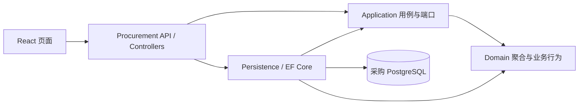

# SCM供应链协同系统

服装品牌与合作工厂采购协作的 C# / DDD 学习项目。当前实现 **1B：创建/编辑草稿 → 提交内容版本 → 工厂接受或拒绝 → 撤回/修改/重提 → 历史与审计查询**，保留 1A 的登录和持久化能力。

当前仍只有一个 Procurement 业务服务，四层项目不是四个微服务。生产任务、消息协作、质检、品牌放行、发货和 ERP 尚未实现。总体设计见 [PLAN.md](PLAN.md)，本阶段约定见 [PLAN-1B.md](PLAN-1B.md)，接口见 [docs/API-1B.md](docs/API-1B.md)，真实结果见 [docs/VALIDATION-1B.md](docs/VALIDATION-1B.md)。[1A 验证记录](docs/VALIDATION-1A.md)保留为历史结果。Articles 保持只读，解决方案和依赖独立。

## 本地启动（Windows / PowerShell）

需要 .NET SDK **10.0.401**、Node **22.20.0**、npm、Docker Desktop 的 Linux 引擎。SDK、NuGet 包、npm 包、镜像及 CI Actions 均固定版本；NuGet/npm 锁文件随代码保存。

在仓库根目录：

```powershell
.\scripts\init-local.ps1
docker compose up -d --wait
dotnet restore ScmCollaboration.slnx --locked-mode
dotnet tool restore
npm ci --prefix web
.\scripts\start-api.ps1
```

另开一个终端：

```powershell
cd C:\Users\odane\Documents\scm-collaboration\web
npm run dev
```

页面：<http://127.0.0.1:5173>。API：<http://127.0.0.1:5180>。OpenAPI：<http://127.0.0.1:5180/openapi/v1.json>。

`init-local.ps1` 首次随机生成 `.env`，重复运行保留原配置。用编辑器查看 `.env` 的 `DEMO_PASSWORD`；不要将该文件提交到 Git。账号为 `buyer`、`quality`、`factory-a`、`factory-b`，共用此本地演示密码，数据库保存密码哈希。buyer 管理草稿并查看全部提交历史；工厂只查看和决定分配给自己的提交版本，不能读取草稿；quality 本阶段没有订单确认权限。

启动脚本先执行真实 EF 迁移和可重复的演示资料初始化，再启动 API。只初始化可运行 `.\scripts\start-api.ps1 -InitializeOnly`。已有用户密码不会被重复初始化覆盖；保留 `.env` 与 PostgreSQL 数据卷配套。

已有 1A 库使用同一入口升级到 `OrderSubmission` 迁移，不需要清库或重建数据卷。本次升级前已备份演示库，原有 3 张订单仍存在；验证细节见 1B 记录。以后升级有业务资料的数据库前也应备份。

如果 Windows 执行策略阻止脚本，可仅对当前进程运行 `powershell -NoProfile -ExecutionPolicy Bypass -File .\scripts\start-api.ps1`，无需修改系统策略。端口 5173、5180、54329 应可用。

## 亲手验收

1. buyer 登录，选工厂 A、上海当天或以后的交期，保存 M 100 / L 50 件草稿。点击“编辑这张订单”，把 M 改为 120，保存后总量为 170 件、Revision 为 2。
2. 点击“提交当前内容”，得到 V1、Revision 3。提交后不能直接编辑；查看 V1 快照，确认工厂、交期和件数。
3. 退出并登录 factory-b，列表没有 A 的 V1。登录 factory-a，查看 V1 快照并接受；显示已接受、170 件，以及“生产流程尚未实现”。
4. 登录 buyer 查看接单订单：Accepted、接受版本 V1、Revision 4；不再提供直接编辑/撤回。审计包含创建、编辑、提交和接受。
5. 再创建一单，提交后由 A 填原因拒绝。buyer 编辑交期/数量后重提 V2，再填原因撤回 V2。查看 V1，内容及拒绝原因保持原样，V2 显示已撤回。

异常验收：空白拒绝/撤回原因不能保存；重复 SKU 和过去的提交交期由服务端拒绝；两位采购读到同一 Revision 时，先保存者成功，后保存/提交者得到 409，页面重新查询，用户确认新内容后才能发起新操作。接受与撤回竞争、已知编号越权等更精确的 HTTP / 数据库场景由自动化测试验证。

网络或 5xx 时页面冻结新操作，保留原账号、幂等键、内容、版本和修订号；恢复后点击“使用原请求重试”。401 保留原请求，让原账号重新登录后确认；409 不自动换修订号重新接单或提交。成功后重新查询当前事实，原成功响应可能早于后续修改。内存中的令牌和待确认请求在刷新时丢失；退出有未确认请求时会提示放弃风险。这是演示限制，正式接入再设计持久恢复。

## 运行测试

保持 PostgreSQL 运行，在根目录执行：

```powershell
.\scripts\test.ps1
```

脚本运行后端测试和前端类型检查/构建。当前结果位于 `artifacts/tests/1b.trx`：**49 通过，0 失败，0 跳过**（20 项领域、29 项数据库/HTTP 用例）。集成测试只接受名字以 `_test` 结尾的专用 PostgreSQL 数据库，并在开始时清空其 public schema；本地默认是 `scm_procurement_test`，不操作演示数据库 `scm_procurement`。禁止将真实业务数据库传入 `SCM_TEST_CONNECTION`。

CI 在 push / pull_request 时运行锁定依赖还原、后端构建/测试及前端构建，使用独立 PostgreSQL 服务。远端 CI 是否通过，以 GitHub Actions 的实际运行结果为准。

## 分层与关键代码



箭头表示引用/调用方向；四层属于一个 Procurement 服务。Application 通过 `IProcurementStore` 端口使用持久化能力，不引用 Persistence。Domain 只依赖 .NET 标准库。没有共享业务实体、通用 CRUD 仓储、MediatR、网关或工作流引擎。

| 位置 | 学习重点 |
| --- | --- |
| `src/Procurement.Domain/PurchaseOrder.cs` | 聚合的编辑、提交、撤回及决定；状态规则、Revision 与件数 |
| `src/Procurement.Domain/SubmittedOrderVersion.cs` | 内容快照、明细快照与只能决定一次的终态 |
| `src/Procurement.Application/ProcurementService.cs` | 角色、工厂归属、上海业务日期、请求规范化和领域行为调用 |
| `src/Procurement.Persistence/ProcurementStore.cs` | 唯一键仲裁；条件更新、版本、审计及原响应同事务提交 |
| `src/Procurement.Persistence/Migrations` | 真正的迁移、正数量约束、同单 SKU 唯一键及本地外键 |
| `src/Procurement.Api/OrdersController.cs` | 薄 Controller；身份从验证后的 JWT 提取，详情不可见为 404 |
| `tests/Procurement.Tests/IntegrationTests.cs` | 真实 PostgreSQL 与 HTTP 验收；SQL 已执行、提交前故障注入 |
| `tests/Procurement.Tests/ConfirmationIntegrationTests.cs` | 同 Revision 保存屏障、决定竞争、快照隔离及 1A 库迁移升级 |
| `web/src/App.tsx` | 原生表单/表格、内存令牌、同意图重试复用幂等键 |

事务内先 `INSERT ... ON CONFLICT DO NOTHING` 争取 `(SubjectId, Operation, Key)` 唯一键。并发失败者等待事务结果后读取原响应。同键异内容返回 409；事务回滚后其他请求可以重新争取该键。提前查询只作快速重放，最终幂等由数据库保证。

**Revision 控制并发，OrderVersion 表示正式提交内容。** 编辑、提交、撤回、决定推进 Revision；只有提交产生新 OrderVersion。根 Revision 与版本 Pending 状态都参与数据库条件更新，防止接单和撤回/拒绝互相覆盖。工厂归属按提交快照检查，撤回改厂后也不会泄露新工厂版本。

## 开发与维护

- 存活检查 `/health/live`；数据库连接就绪检查 `/health/ready`。业务失败返回 ProblemDetails 和 traceId。
- JSON 技术日志记录方法、路径、状态及耗时；不记录请求体、密码、令牌或幂等内容。`business_audit` 是单独的业务审计表。
- PostgreSQL 只绑定本机 54329；应用账号 `scm_procurement` 不是超级用户。仅管理本项目的容器和数据卷。
- API / 前端用 Ctrl+C 停止；数据库用 `docker compose stop`，再启动用 `docker compose up -d --wait`。不要为了重启删除数据卷。
- 新增迁移时，先 `. .\scripts\load-local.ps1`，再 `dotnet ef migrations add 名称 --project src/Procurement.Persistence --startup-project src/Procurement.Api`。
- Docker 镜像拉取失败时检查 Docker Desktop 自己的代理配置；仓库内 Git 代理只影响 Git。

## 教学简化与下一步

演示登录和 OpenAPI 仅在 Development 开放；本地 HTTP、四个预置账号、内存令牌和共用演示密码适用于这轮学习。没有账号注册、刷新令牌、密码找回或生产身份提供商。未做压力测试，不宣称性能或生产收益。

1B 仍是采购本地事务，没有领域事件或集成事件。1C 引入 Production 与 RabbitMQ 时同时实现 Outbox/Inbox、任务业务去重和任务建立回执。接单后的交期协商、减量、取消和换厂尚未实现，不能直接修改绕过变更流程。幂等记录暂不自动过期，长期运行再制定归档规则。

你的 1B 小练习：在 `OrderConfirmationTests.cs` 的原因测试中，亲手补一个**恰好 500 字符原因可以拒绝**的边界用例；断言根状态 Rejected、版本状态 Rejected、Reason 长度 500、Revision 只增加 1。现有测试已覆盖空白与 501 字符拒绝，先预测结果，再运行 `dotnet test --filter FullyQualifiedName~OrderConfirmationTests`。
