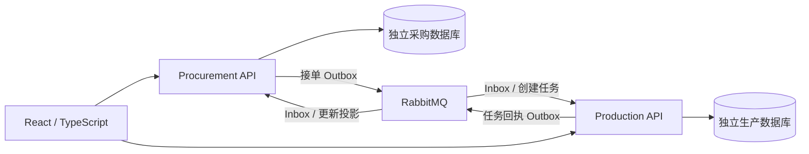

# SCM供应链协同系统

服装品牌与合作工厂采购协作的 C# / DDD 学习项目。**当前 1C 已实现并本地验证：创建/编辑草稿 → 提交内容版本 → 工厂接受 → 自动建立生产任务 → 两端查看确认明细。** 保留拒绝、撤回、重提、快照、并发控制与审计。

现在有 Procurement、Production 两个业务微服务，各自四层项目、API 进程、数据库、账号和迁移。任务中的件数是确认订购量；生产完成量、批次、质检、品牌放行、发货与 ERP 尚未实现。Articles 保持只读，SCM 使用独立代码和依赖。

设计见 [总计划](PLAN.md)、[1C 计划](PLAN-1C.md)；契约见 [API 与事件说明](docs/API-1C.md)，实际结果见 [1C 验证记录](docs/VALIDATION-1C.md)。[1A](docs/VALIDATION-1A.md)、[1B](docs/VALIDATION-1B.md) 是历史记录。

## Docker Compose 启动

需要 Docker Desktop 的 Linux 引擎和 PowerShell 7。在仓库根目录执行：

```powershell
.\scripts\init-local.ps1
docker compose up -d --build
```

首次会还原锁定依赖、构建三个镜像并执行建库、EF 迁移、演示资料和消息拓扑初始化。`database-upgrade`、`procurement-init`、`production-init`、`messaging-init` 是一次性任务，正常结束为 Exited(0)。用 `docker compose ps -a` 检查；两个 `/health/ready` 返回数据库就绪和消息连接状态。基础镜像固定 tag/digest，SDK/NuGet/npm 使用精确版本及锁文件。

| 入口 | 地址 |
| --- | --- |
| 页面 | <http://127.0.0.1:5173> |
| Procurement / OpenAPI | <http://127.0.0.1:5180/openapi/v1.json> |
| Production / OpenAPI | <http://127.0.0.1:5181/openapi/v1.json> |
| PostgreSQL | 本机 54329 |
| RabbitMQ AMQP / 管理页面 | 本机 56729 / <http://127.0.0.1:15679> |

用编辑器查看 `.env` 的 `DEMO_PASSWORD`。账号 `buyer`、`factory-a`、`factory-b`、`quality` 共用本地演示密码；库里保存密码哈希。Buyer 看全部订单和任务；工厂只能读取、决定本厂提交版本及查看本厂任务；Quality 暂无生产权限。Production 独立验证 JWT，不通过采购数据库鉴权。

`init-local.ps1` 保留已有密钥，只补缺少项；`.env` 被忽略，不能提交。POSTGRES_PASSWORD 是建库管理员密码；两个服务密码分别属于各自非超级用户；JWT_KEY 用于演示令牌签名/验证；RabbitMQ 管理员只用于初始化，每个业务服务另有受限消息凭证。保留 `.env` 和数据卷配套，修改文件不会自动更改已有数据库密码。

## 旧数据升级和补建

先停止旧版本机 API 的写入并备份采购库，再启动新 Compose；不要删除数据卷。增量脚本为旧实例添加生产数据库及账号，迁移新增消息相关结构。首次建卷脚本不能代替已有库升级。

历史已接单订单需要显式补建；新接单自动写 Outbox。先查看候选，再执行：

```powershell
docker compose exec -T procurement-api dotnet Procurement.Api.dll --backfill-production
docker compose exec -T procurement-api dotnet Procurement.Api.dll --backfill-production --apply
```

仅限 Development；同一 DecisionId 重复执行不会重复追加事件/任务。不推进订单 Revision、不重新接单、不覆盖历史或原 HTTP 结果。本轮已有两单已实际补建，详见验证记录。

## 亲手验收

1. Buyer 创建工厂 A 的 M 100 / L 50 件订单，交期为上海当天或以后；提交当前内容并查看 V1 快照。
2. Factory A 查看 V1 并接受。采购本地提交后显示已接受，任务可能暂时显示建立中；收到回执后显示任务编号与 150 件确认订购量。
3. Buyer 查看同单，任务编号相同；历史、决定及审计仍可读。Factory B 列表没有这张任务，已知 ID 查询也返回 404。
4. 暂停 RabbitMQ 后接单另一单，订单仍 Accepted、任务 Pending；恢复后自动 Created。Production 离线也先 Pending，恢复后读取持久队列完成。

演示脚本每次新增自己的订单并保留已有订单；`-Faults` 短暂停止本项目 RabbitMQ 和 Production，在 finally 中恢复：

```powershell
.\scripts\demo-1c.ps1          # 正常、原 HTTP 重放、跨厂 404
.\scripts\demo-1c.ps1 -Faults  # 两个实际容器停机恢复
```

结果保存到忽略的 `artifacts/demo/1c.json`。消息重复、提交/ack 故障和并发由自动化测试验证。页面只在收到匹配回执后认定任务建立；发送成功不代表下游完成。明细查询失败保持“已建立”，提示稍后刷新。

## 本机调试与测试

本机调试另需 .NET SDK **10.0.401**、Node **22.20.0**。先停止 Compose 中的 API 和前端，避免端口冲突：

```powershell
docker compose stop procurement-api production-api web
dotnet restore ScmCollaboration.slnx --locked-mode
dotnet tool restore
npm ci --prefix web
.\scripts\upgrade-1c.ps1
.\scripts\start-api.ps1
```

另两个终端分别执行 `.\scripts\start-production.ps1`、`npm run dev --prefix web`。启动脚本先迁移再运行；消息拓扑由 upgrade 初始化。回到容器运行用 `docker compose up -d`。

保持 PostgreSQL / RabbitMQ 运行、完成增量建库后执行：

```powershell
.\scripts\test.ps1
```

当前 **74 通过、0 失败、0 跳过**，包含原 49 项回归；真实 PostgreSQL / RabbitMQ，结果为 `artifacts/tests/1c.trx`。测试清空专用 `scm_procurement_test`、`scm_production_test` 的 public schema 和 `scm_1c_tests` 的测试队列，禁止传入演示库/业务库。前端运行 TypeScript 检查和 Vite 构建。GitHub Actions 已配置两个服务数据库和 broker，**远端 CI 本轮未运行**。

## 结构与学习入口



两边都是 API → Application → Domain，Persistence 实现应用端口并持久化 Domain。Domain 不依赖 EF/消息/HTTP；没有共享业务实体、通用 CRUD 仓储、MediatR、MassTransit、网关或工作流引擎。`Scm.IntegrationContracts` 只共享线上 DTO；`Scm.Messaging` 复用实际需要的技术存储与 worker，各服务仍有独立表和事务。

| 位置 | 学习重点 |
| --- | --- |
| `src/Procurement.Domain/PurchaseOrder.cs`、`OrderVersionAccepted.cs` | AcceptVersion 返回内部领域事实；聚合不发消息 |
| `src/Procurement.Application/AcceptedOrderEvents.cs` | 指定版本快照映射集成事件 |
| `src/Procurement.Persistence/ProcurementStore.cs` | 接单、审计、HTTP 结果、投影和 Outbox 同事务 |
| `src/Scm.Messaging/MessagingWorker.cs` | confirm、持久队列、恢复连接、安全 ack |
| `src/Scm.Messaging/MessageProcessor.cs` | Inbox 唯一键、原文保管、业务与消息处理同事务 |
| `src/Production.Domain/ProductionTask.cs` | 已确认快照的任务聚合和明细约束 |
| `src/Production.Persistence/ProductionMessageHandler.cs` | 外部 DTO 转内部输入；任务、审计、回执同事务 |
| `src/Procurement.Persistence/ProductionTaskCoordination.cs` | 回执、独立投影、历史补建 |
| `tests/Procurement.Tests/TaskCoordinationTests.cs` | 并发、三层幂等、真实 broker 故障及数据库权限 |

HTTP 幂等是 `(SubjectId, Operation, Key)`；消息幂等是 `(ConsumerName, MessageId)`；任务另有 DecisionId、订单版本与 OrderId 唯一约束。换 MessageId 不会绕过业务去重。Created 不受迟到 Failed 降级，错误版本/工厂/内容也不能覆盖。

你的 1C 小任务：在 `DuplicateMessageAndDifferentMessageIdCreateOneTaskAuditAndReceipt` 中，为新 MessageId 的消息**颠倒明细顺序**，预测任务编号和确认件数，再运行该测试。业务摘要会规范化顺序，应复用同一任务。

## 最小维护和教学取舍

- `/health/live` 检查进程，`/health/ready` 检查数据库并报告消息 connected/recovering；broker 退化时仍允许安全写 Outbox。日志及事件有 TraceId/CorrelationId，未部署追踪收集器。
- 排障和原消息重试命令见 [API 文档](docs/API-1C.md)。先核对错误与前置事实；不编辑原确认快照、消息原文或手工标记 Processed/Sent。
- 停止用 `docker compose stop`，恢复用 `docker compose up -d`；不能删除卷作为修复。迁移、数据恢复先备份，在不写业务数据时操作。
- 本机 HTTP、预置账号、共用演示密码/JWT 密钥；端口仅绑定 loopback。本地连接关闭未配置的 Kerberos 尝试，云部署另行配置 TLS/身份。
- 每服务单发布 worker；固定 5 秒恢复重试、单节点 RabbitMQ、原文/幂等记录不自动清理、Vite 开发服务器。没有多实例发布租约、动态退避、完整人工处理界面或压力测试。
- 完成量留到 1D，Fulfillment 留到阶段 2；AWS 在交付阶段设计，本轮未创建云资源。
