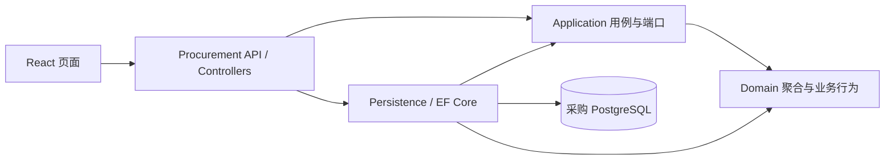

# SCM供应链协同系统

服装品牌与合作工厂采购协作的 C# / DDD 学习项目。当前实现 **1A：登录 → 创建采购订单草稿 → 列表/详情 → 重启后仍可查询**。

采购草稿没有提交版本，不表示工厂接单。生产、消息协作、质检、品牌放行、发货和 ERP 尚未实现。总体设计见 [PLAN.md](PLAN.md)，1A 约定见 [PLAN-1A.md](PLAN-1A.md)，实际验证见 [docs/VALIDATION-1A.md](docs/VALIDATION-1A.md)。Articles 保持只读，解决方案和依赖独立。

## 本地启动（Windows / PowerShell）

需要 .NET SDK **10.0.401**、Node **22.20.0**、npm、Docker Desktop 的 Linux 引擎。SDK、NuGet 包、npm 包、镜像及 CI Actions 均固定版本；NuGet/npm 锁文件随代码保存。

在仓库根目录：

```powershell
.\scripts\init-local.ps1
docker compose up -d --wait
dotnet restore ScmCollaboration.slnx --locked-mode
dotnet tool restore
npm ci --prefix web
.\scripts\start-api.ps1
```

另开一个终端：

```powershell
cd C:\Users\odane\Documents\scm-collaboration\web
npm run dev
```

页面：<http://127.0.0.1:5173>。API：<http://127.0.0.1:5180>。OpenAPI：<http://127.0.0.1:5180/openapi/v1.json>。

`init-local.ps1` 首次随机生成 `.env`，重复运行保留原配置。用编辑器查看 `.env` 的 `DEMO_PASSWORD`；不要将该文件提交到 Git。账号为 `buyer`、`quality`、`factory-a`、`factory-b`，共用此本地演示密码，数据库保存密码哈希。只有 `buyer` 可以创建和查看草稿；其他角色的列表/创建为 403，已知草稿详情为 404。

启动脚本先执行真实 EF 迁移和可重复的演示资料初始化，再启动 API。只初始化可运行 `.\scripts\start-api.ps1 -InitializeOnly`。已有用户密码不会被重复初始化覆盖；保留 `.env` 与 PostgreSQL 数据卷配套。

如果 Windows 执行策略阻止脚本，可仅对当前进程运行 `powershell -NoProfile -ExecutionPolicy Bypass -File .\scripts\start-api.ps1`，无需修改系统策略。端口 5173、5180、54329 应可用。

## 亲手验收

1. 登录 buyer，选择工厂 A，指定交期，选择 S001/蓝色/M 100 件和 S001/蓝色/L 50 件，保存草稿。详情总量为 150 件，状态为草稿。
2. 刷新页面后重新登录，查询列表和详情。关闭并重启 API 后，数据仍存在。
3. 新建订单时将两行改为相同 SKU、不同数量，服务端拒绝；订单不会保存。
4. 退出并登录 factory-a、factory-b 或 quality，点击“验证草稿访问权限”，得到 403。已知草稿编号也不能越权读取。
5. 使用自动化测试验证相同幂等键重试、异内容冲突、8 个并发请求及保存中途失败的回滚。

创建请求失败时，页面冻结输入并保留原幂等键及内容；网络或 5xx 后点击“使用原请求重试”。“开始另一张订单”才明确发起另一项创建意图。成功后清空表单，避免再次点击保存误建相同订单。

## 运行测试

保持 PostgreSQL 运行，在根目录执行：

```powershell
.\scripts\test.ps1
```

脚本运行后端测试和前端类型检查/构建。结果位于 `artifacts/tests/1a.trx`。集成测试只接受名字以 `_test` 结尾的专用 PostgreSQL 数据库，并在开始时清空其 public schema；本地默认是 `scm_procurement_test`，不操作演示数据库 `scm_procurement`。禁止将真实业务数据库传入 `SCM_TEST_CONNECTION`。

CI 在 push / pull_request 时运行锁定依赖还原、后端构建/测试及前端构建，使用独立 PostgreSQL 服务。远端 CI 是否通过，以 GitHub Actions 的实际运行结果为准。

## 分层与关键代码



箭头表示引用/调用方向；四层属于一个 Procurement 服务。Application 通过 `IProcurementStore` 端口使用持久化能力，不引用 Persistence。Domain 只依赖 .NET 标准库。没有共享业务实体、通用 CRUD 仓储、MediatR、网关或工作流引擎。

| 位置 | 学习重点 |
| --- | --- |
| `src/Procurement.Domain/PurchaseOrder.cs` | 草稿聚合、明细实体、件数与商品快照；私有 setter 和只读明细 |
| `src/Procurement.Application/ProcurementService.cs` | 角色检查、输入规范化、服务端解析商品资料、调用领域行为 |
| `src/Procurement.Persistence/ProcurementStore.cs` | 唯一键仲裁请求；订单、业务审计、原响应同事务提交 |
| `src/Procurement.Persistence/Migrations` | 真正的迁移、正数量约束、同单 SKU 唯一键及本地外键 |
| `src/Procurement.Api/OrdersController.cs` | 薄 Controller；身份从验证后的 JWT 提取，详情不可见为 404 |
| `tests/Procurement.Tests/IntegrationTests.cs` | 真实 PostgreSQL 与 HTTP 验收；SQL 已执行、提交前故障注入 |
| `web/src/App.tsx` | 原生表单/表格、内存令牌、同意图重试复用幂等键 |

事务内先 `INSERT ... ON CONFLICT DO NOTHING` 争取 `(SubjectId, Operation, Key)` 唯一键。并发失败者等待事务结果后读取原响应。同键异内容返回 409；事务回滚后其他请求可以重新争取该键。提前查询只作快速重放，最终幂等由数据库保证。

## 开发与维护

- 存活检查 `/health/live`；数据库连接就绪检查 `/health/ready`。业务失败返回 ProblemDetails 和 traceId。
- JSON 技术日志记录方法、路径、状态及耗时；不记录请求体、密码、令牌或幂等内容。`business_audit` 是单独的业务审计表。
- PostgreSQL 只绑定本机 54329；应用账号 `scm_procurement` 不是超级用户。仅管理本项目的容器和数据卷。
- API / 前端用 Ctrl+C 停止；数据库用 `docker compose stop`，再启动用 `docker compose up -d --wait`。不要为了重启删除数据卷。
- 新增迁移时，先 `. .\scripts\load-local.ps1`，再 `dotnet ef migrations add 名称 --project src/Procurement.Persistence --startup-project src/Procurement.Api`。
- Docker 镜像拉取失败时检查 Docker Desktop 自己的代理配置；仓库内 Git 代理只影响 Git。

## 教学简化与下一步

演示登录和 OpenAPI 仅在 Development 开放；本地 HTTP、四个预置账号、内存令牌和共用演示密码适用于这轮学习。没有账号注册、刷新令牌、密码找回或生产身份提供商。未做压力测试，不宣称性能或生产收益。

1A 没有跨服务事件，所以尚无 Outbox/Inbox；1C 首条跨服务消息时一起实现。Revision 为 1，与未来提交版本分开；当前没有草稿编辑，因此不声称已验证接单与修改的并发冲突。幂等记录暂不自动过期，长期运行再制定归档规则。

你的练习：给集成测试补一个场景——**相同内容使用不同幂等键，应创建两张不同订单**。它说明“重试一次操作”与“再次下单”的业务区别。
