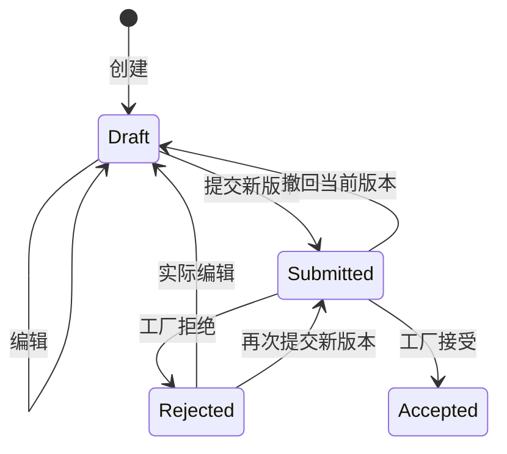

# 1B API 与业务契约

日期：2026-10-04。已实现范围：Procurement 内编辑、提交版本、撤回及工厂接受/拒绝。基础登录、草稿创建、列表及详情沿用 [1A 契约](API-1A.md)。实际验证见 [VALIDATION-1B.md](VALIDATION-1B.md)。

## 身份和请求约定

所有业务接口需要 `Authorization: Bearer <token>`。buyer 为品牌采购；factory-a / factory-b 的角色为 Factory，工厂归属从已验证 JWT 的 `factory_id` 获取。quality 在本阶段没有订单确认权限。

所有写接口需要 1–128 字符的 `Idempotency-Key`。新增写接口还需要正整数 `expectedRevision`，取自订单详情或当前 Pending 版本的 `expectedRevision`。日期格式为 `YYYY-MM-DD`，数量为 1–2147483647 的整数，明细为 1–100 条，SKU 不重复。

工厂请求不接受调用者指定工厂归属；即使请求体额外传 `factoryId`，也不会改变服务端身份。不可见的订单版本返回 404，避免暴露另一工厂的数据。草稿及品牌审计不对工厂开放。

## 接口

| 方法与路径 | 身份 | 输入 / 输出 |
| --- | --- | --- |
| `PUT /api/purchase-orders/{id}/draft` | Buyer | 完整替换草稿输入，返回操作结果；只允许 Draft / Rejected |
| `POST /api/purchase-orders/{id}/submissions` | Buyer | `{ expectedRevision }`；生成新的内容版本 |
| `POST /api/purchase-orders/{id}/versions/{version}/withdraw` | Buyer | `{ expectedRevision, reason }`；当前 Pending 版本撤回 |
| `POST /api/purchase-orders/{id}/versions/{version}/accept` | 所属 Factory | `{ expectedRevision }`；接受指定 Pending 版本 |
| `POST /api/purchase-orders/{id}/versions/{version}/reject` | 所属 Factory | `{ expectedRevision, reason }`；拒绝指定 Pending 版本 |
| `GET /api/purchase-orders/{id}/versions?page=1&pageSize=20` | Buyer | 版本历史分页 |
| `GET /api/purchase-orders/{id}/versions/{version}` | Buyer | 单个提交快照及其决定 |
| `GET /api/factory/order-versions?status=Pending&page=1&pageSize=20` | Factory | 自己的版本列表；status 可省略或为 Pending / Accepted / Rejected / Withdrawn |
| `GET /api/factory/orders/{id}/versions/{version}` | 所属 Factory | 自己的提交快照 |
| `GET /api/purchase-orders/{id}/audit?page=1&pageSize=20` | Buyer | 业务审计分页 |

新增写接口成功均为 200；创建草稿仍是 201，包含 Location。分页为 page 1–100000、pageSize 1–100，排序包含稳定的编号兜底。

编辑示例（编号通过基础资料接口获取）：

```json
{
  "expectedRevision": 1,
  "factoryId": "<工厂 GUID>",
  "deliveryDate": "2026-10-31",
  "lines": [
    { "skuId": "<M 码 SKU GUID>", "quantity": 120 },
    { "skuId": "<L 码 SKU GUID>", "quantity": 50 }
  ],
  "reason": "M 码需求调整"
}
```

保留的 SKU 保留原 LineId 和商品说明；新增 SKU 有新 LineId，删除的 SKU 从当前草稿移除。提交历史的明细不随当前草稿删除。完全相同的内容保存不推进 Revision、不增加业务审计，但仍保存该请求的成功结果。

提交输入示例：`{ "expectedRevision": 2 }`。一次实际提交的结果示例：

```json
{
  "orderId": "aad15613-f2a9-475f-8819-6a7006522173",
  "orderVersion": 1,
  "orderStatus": "Submitted",
  "revision": 3,
  "versionStatus": "Pending",
  "decisionId": null
}
```

操作结果的字段均固定：`orderId / orderVersion / orderStatus / revision / versionStatus / decisionId`。编辑结果没有目标提交版本，`orderVersion / versionStatus / decisionId` 均为 null。接受/拒绝时生成稳定的 `decisionId`，撤回没有工厂决定编号。它是业务事实标识，尚未成为集成事件。

## 状态、版本与快照



提交后的工厂、交期、商品说明、明细编号和件数是保留的内容快照；决定字段可以从 Pending 变为 Accepted / Rejected / Withdrawn 一次。历史终态不能覆盖。当前 Draft / Rejected 可以提交；Submitted 必须先撤回才能编辑；Accepted 禁止直接编辑、重提或撤回。

- `revision`：整张订单的并发修订号。实际编辑、提交、撤回或决定各加 1。
- `version` / `orderVersion`：正式内容版本。只有提交增加；从 V1 起，历史保留。
- `submittedRevision`：该快照提交时的修订号；`resolvedRevision` 为决定/撤回后的修订号。
- 快照 `expectedRevision` 只在它是当前 Pending 版本且订单为 Submitted 时提供，终态为 null。

版本详情包含 `orderId / version / factoryId / factoryName / deliveryDate / submittedRevision / submittedBy / submittedAt / status / decisionId / resolvedBy / resolvedAt / resolvedRevision / reason / expectedRevision / lines`。时间存储及 API 输出使用 UTC；页面按浏览器时区显示。上海业务日期由服务端 TimeProvider 转换获得，与浏览器时区无关。

提交交期不得早于上海当天，草稿可以保存过去交期；提交时重新验证工厂和 SKU 仍可用。拒绝/撤回原因必填，去掉首尾空白后为 1–500 字符；修改原因可选，最多 500 字符。

工厂按**版本自己的工厂归属**查询，而不是当前订单的工厂。例如 V1 给 A、撤回后 V2 给 B：A 可以继续查看自己的 V1；A 看不到也不能决定 V2，B 看不到 V1。任何历史版本不能决定当前新版本。

审计输出为 `id / action / subjectId / occurredAt / resultRevision / orderVersion / reason / changes`。动作是 DraftCreated / UpdateDraft / SubmitOrder / WithdrawSubmission / AcceptVersion / RejectVersion；修改的 changes 是包含 Before / After 的 JSON 字符串。失败、无变更和幂等重放不增加成功业务审计。技术故障在结构化日志中记录。

## 请求重放与本地一致性

幂等记录唯一键为 `(SubjectId, Operation, Key)`。编辑明细先按 SKU/数量排序；原因去首尾空白；请求哈希还包含订单编号、目标版本及原 expectedRevision。同键同规范化内容返回**原处理结果**，即使订单后来已经推进；同键异内容返回 409。更换修订号属于新意图，必须用新键。不同键再次决定已终结版本返回 409。

读取原结果前仍检查角色与目标版本归属。不要仅凭一个原成功响应判断当前状态，应再查询订单/快照。创建仍沿用 1A 的规范化与结果格式，原幂等记录迁移后可重放。

业务更新、版本/明细、成功审计及请求结果在同一本地事务提交。请求唯一键由 PostgreSQL 仲裁；根 Revision 与版本原 Status 都参与条件更新；每单最多一个 Pending 版本由部分唯一索引保证。两个独立请求读到同一 Revision 后竞争更新，实际变更最多一方提交，另一方为 409；不会留下部分决定或空成功结果。

| 状态码 | 含义与调用者处理 |
| --- | --- |
| 400 | 格式/业务输入错误，如空白原因、过去的提交交期；修改输入后使用新意图 |
| 401 | 未登录、过期或无效身份；重新登录原账号后可用原请求确认未知结果 |
| 403 | 角色无权使用该接口 |
| 404 | 订单/版本不存在或不可见 |
| 409 | 幂等内容冲突、旧 Revision、历史终态或并发竞争；重新查询后由用户确认新操作 |
| 500 / 网络失败 | 结果可能未知，保留原账号、键、版本、修订号和内容后重试 |

业务异常及输入错误采用 ProblemDetails，包含 traceId；详情接口部分 404 由 MVC 默认处理。本阶段没有跨服务 API、领域事件、集成事件、Outbox 或 Inbox；RabbitMQ/生产任务在 1C 实现，不把工厂接受响应当作生产任务已建立。
