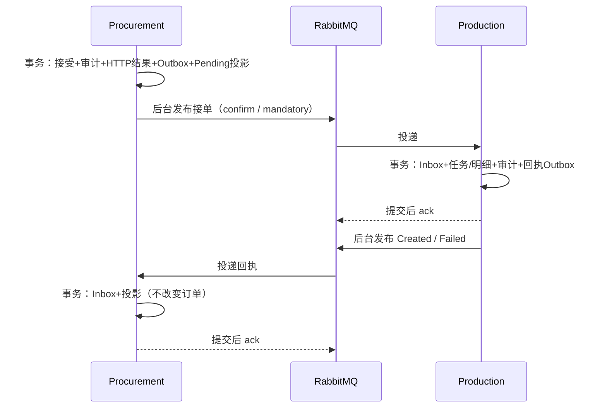

# 1C API、事件与恢复契约

2026-10-05；已实现并本地验证。写接口沿用 [1B](API-1B.md)，本页补充可靠建任务。Controller 风格统一；运行时 OpenAPI 在各 API 的 `/openapi/v1.json`（Development）。

## 查询与授权

业务查询需要 Procurement 演示登录颁发的 Bearer JWT；Production 自己验证签名、issuer、audience、有效期、角色和工厂声明。FactoryId 来自已验证身份，查询参数不能扩展归属。

| 服务 / 方法 | 路径 | 权限和结果 |
| --- | --- | --- |
| Procurement GET | `/api/purchase-orders/{id}/production-task` | Buyer，只读本库投影 |
| Procurement GET | `/api/factory/orders/{id}/versions/{version}/production-task` | 所属 Factory，按指定版本授权 |
| Production GET | `/api/production-tasks?page=1&pageSize=20` | Buyer 全部；Factory 本厂；Quality 403 |
| Production GET | `/api/production-tasks/{id}` | Buyer 或所属 Factory；不可见为 404 |
| 两服务 GET | `/health/live`、`/health/ready` | 匿名；ready 数据库故障 503；消息退化单独报告 recovering |

分页 page 1–100000、pageSize 1–100。没有手工创建任务的 HTTP 接口。接单成功只表示采购事务完成，不等待 Production；原 HTTP 重放不再生成事实/Outbox。

任务投影字段：`orderId / acceptedOrderVersion / status / taskId / updatedAt / attempts / errorCode`。

| status | 含义 |
| --- | --- |
| NotApplicable | 没有已接受版本 |
| NotScheduled | 历史接受尚未补建 |
| Pending | 请求已落采购库，未收到匹配回执；errorCode=DeliveryDelayed 表示发送暂失败 |
| Blocked | 匹配的永久业务失败，需要修复 |
| Created | 已收到匹配任务回执；按 TaskId 独立查询 Production 明细 |

attempts 是出站尝试计数；updatedAt 是投影最后更新时间，并非每次连接尝试时间。消息已发、下游未完成时仍 Pending。页面 Pending 每 2 秒轮询最多 60 秒，离开停止，可手动刷新；明细读取失败不改 Created。

任务详情：`id / orderId / acceptedOrderVersion / factoryId / factoryName / deliveryDate / createdAtUtc / lines`；明细 `lineId / skuId / style / color / size / confirmedQuantity`。确认订购量不表示完成量或可发数量。

## 消息契约与所有权

源码：[Events.cs](../src/Scm.IntegrationContracts/Events.cs)；[完整 JSON 示例](EVENTS-1C.json) 摘自本轮新建演示订单的接单与 Created 回执（不含凭证），不是生产业务数据。

信封包含 MessageId、EventType、ContractVersion=1、FactId、SourceService、SourceRevision≥1、OccurredAtUtc、CorrelationId；CausationId/TraceParent 可以为空。契约独立于两个领域模型。

| 事件 / 拥有者 | FactId / 数据 |
| --- | --- |
| PurchaseOrderAcceptedV1 / Procurement | DecisionId；OrderId、AcceptedOrderVersion、FactoryId/Name、DecisionId、AcceptedRevision/AtUtc、DeliveryDate、1–100 条 AcceptedLine |
| ProductionTaskCreatedV1 / Production | TaskId；订单版本/工厂/DecisionId、AcceptedContentHash、TaskId、CreatedAtUtc |
| ProductionTaskCreationFailedV1 / Production | 原接单 MessageId 作为失败事实编号；订单关联/摘要，ErrorCode 为 InvalidAcceptedOrder / AcceptedContentConflict |

接单事件来自指定已接受快照；信封 FactId、修订号及时间须与数据匹配。业务摘要对明细按 LineId 排序，规范化 UTC 微秒（与 PostgreSQL 精度一致），不含传输编号/追踪字段。Inbox 比较规范化完整信封；传输字段变化应换 MessageId，仍由业务事实去重。

Production 数据库唯一 OrderId、DecisionId、(OrderId, AcceptedOrderVersion)。同一事实同内容复用任务/回执；异内容或另一个确认版本阻塞、不覆盖。采购回执匹配已接受版本、决定、工厂、摘要，不推进订单 Revision。Created 不被迟到 Failed 降级；合法 Created 可解除 Blocked。前置缺失持久 Pending，不自动创建采购订单或放宽规则。



durable direct exchange `scm.procurement.events` → durable queue `scm.production.accepted-orders`，路由 PurchaseOrderAcceptedV1。`scm.production.events` → `scm.procurement.receipts`，路由两个回执类型。拓扑先由管理员建立；业务账号只发自己的交换机、读自己的队列，无 configure 权限。

持久消息、mandatory、confirm；不可路由/nack/超时不能写 SentAt。confirm 后本地标记失败可重复发布。消费成功与业务同事务提交后 ack；暂失败回滚业务、原文持久 Pending 后可 ack，由 worker 重试；不能落库时不 ack，关闭通道等 broker 重投。失败记录不是业务完成凭据。

## Development 维护入口

查询最多 50 条待处理 Inbox 和最近 20 条失败摘要，不打印原文/凭证：

```powershell
docker compose exec -T production-api dotnet Production.Api.dll --inspect-messages
docker compose exec -T procurement-api dotnet Procurement.Api.dll --inspect-messages
docker compose exec -T production-api dotnet Production.Api.dll --retry-message <MessageId>
docker compose exec -T procurement-api dotnet Procurement.Api.dll --retry-message <MessageId>
```

重试将未成功 Inbox 恢复 Pending；无 Inbox 的单份隔离原文交同一处理器立即重放。Processed 不重置；找不到唯一原文则报错；非法契约仍保留失败。编号/内容不变，不能靠重试更正已确认内容。CLI 不启动 worker，Pending 由正在运行的服务恢复；未知版本需先提供兼容代码。

维护只允许 Development；生产部署另行设计管理员授权。历史补建先查看，再 `--backfill-production --apply`，见 README。固定 5 秒重试、原文保留、单发布 worker 为教学取舍；高可用、租约、自动归档和完整运维页面未实现。
