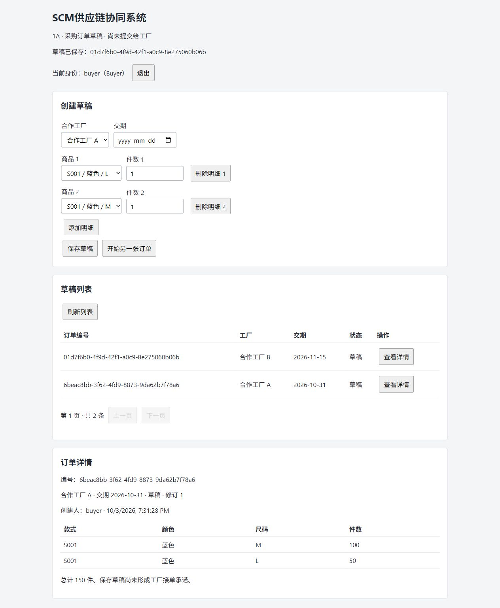
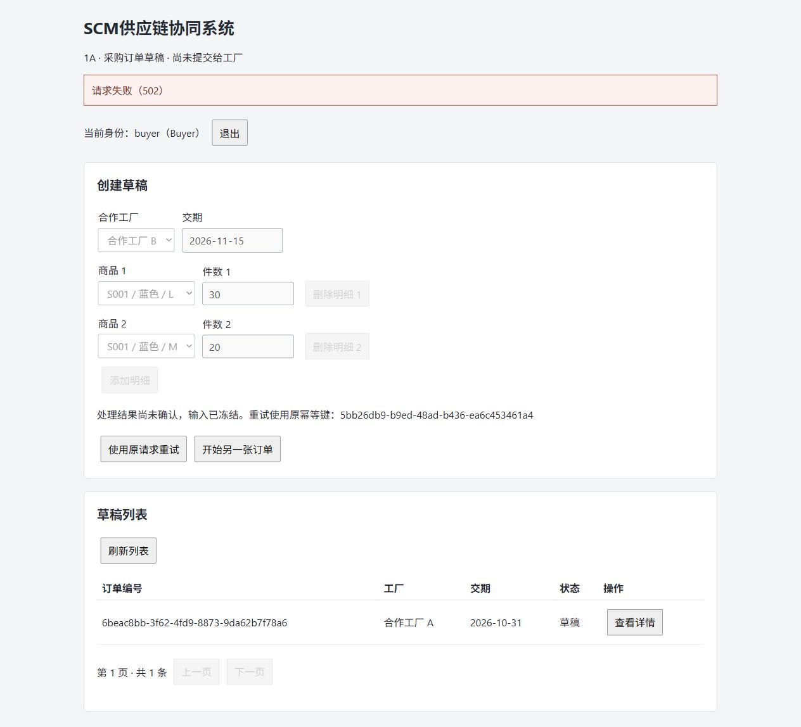

# 1A 实际验证记录

日期：2026-10-03（Asia/Shanghai）。状态：已实现并完成本地验证，等待用户验收。此记录只覆盖采购订单草稿；不代表整个 SCM 项目已完成。

## 环境和已固定版本

| 项目 | 实际值 |
| --- | --- |
| 主机 | Windows / PowerShell；Docker Linux 引擎、WSL 2 |
| .NET SDK / Runtime | 10.0.401 / 10.0.12 |
| EF Core / EF Relational / dotnet-ef | 10.0.12 |
| Npgsql EF Provider | 10.0.3 |
| PostgreSQL | 18.6，Debian bookworm，独立 SCM 容器 |
| 镜像 digest | sha256:3725f4e2499eef5134592b3b4ab79a543ed7f8e533b05b5b637af926630f6650 |
| Node / npm | 22.20.0 / 10.9.3 |
| React / TypeScript / Vite / React 插件 | 19.3.0 / 7.0.2 / 8.3.2 / 6.1.1 |

版本核实与实际验证分开：[Npgsql 包元数据](https://www.nuget.org/packages/Npgsql.EntityFrameworkCore.PostgreSQL/10.0.3)声明兼容 EF 10.0.4–10.x；前端正式版本通过 npm registry 查询。随后实际还原、编译、迁移和测试均成功，才认定本轮组合可用。EF Relational 已显式固定 10.0.12，解决首次构建时传递依赖选中 10.0.4 的冲突。

## 自动化和启动结果

| 实际执行 | 结果 |
| --- | --- |
| `docker pull postgres:18.6-bookworm` | 退出码 0，记录并固定 digest |
| `docker compose up -d --wait` | 退出码 0，独立容器 Healthy |
| `dotnet restore ScmCollaboration.slnx --locked-mode` | 退出码 0，5 个项目锁文件可用 |
| `dotnet tool restore` | 退出码 0，EF 工具 10.0.12 |
| `dotnet build ScmCollaboration.slnx` | 退出码 0；成功构建，0 警告、0 错误 |
| `dotnet ef migrations add InitialDraft ...` | 退出码 0，生成真实迁移及模型快照 |
| `scripts/start-api.ps1` | 实际迁移/预置成功，重复初始化无重复资料；API 监听 127.0.0.1:5180 |
| `scripts/test.ps1` | 退出码 0；26 通过、0 失败、0 跳过；包含前端类型检查/构建 |
| `npm install --no-fund --no-audit` | 退出码 0，产生 package-lock.json |
| `npm run build` | 退出码 0，TypeScript 检查及 Vite 构建通过 |
| `npm run dev` | 实际启动于 127.0.0.1:5173 |
| PostgreSQL 应用账号 | 实际查询 rolsuper=false、rolcreatedb=false |
| Git 忽略规则 / Articles | .env、node_modules、bin 被忽略；Articles 工作区仍干净 |

最后完整测试结果保存于 `artifacts/tests/1a.trx`，未将运行产物提交到 Git。测试使用独立的真实 `scm_procurement_test` 数据库；没有使用 EF 内存数据库证明事务或并发。11 项领域用例 + 15 项数据库/HTTP 用例，共 26 项；理论测试各输入独立计数。

测试覆盖：正整数及默认值绕过、空明细、同 SKU 不同数量冲突、不同尺码允许、只读聚合明细；HTTP 小数/溢出/错误类型拒绝；未知工厂/商品；数据库正数量、同单 SKU 唯一及外键；原响应重放、同键异内容 409、8 个同时请求只产生一单、异内容并发只有一方成功；SQL 保存后、提交前注入异常，订单/审计/幂等一起回滚，再次请求成功；重启 API 查询；预置重复执行；两家工厂及质量身份不可访问草稿；登录失败；JWT 有效签名对照与签名/到期/issuer/audience/缺失身份声明拒绝；健康检查、OpenAPI、分页；Production 不开放演示登录和 OpenAPI。

这些是功能与一致性测试，不是压力测试，不据此宣称吞吐量、生产规模或业务收益。

## 浏览器实际验收

1. buyer 登录后，选择工厂 A 和 S001 蓝色 M 100 / L 50；成功保存，列表和详情显示 150 件草稿。
2. 刷新页面，回到登录；重新登录后仍能查看同一份订单。
3. 两行相同 SKU 时显示“同一订单不能包含重复 SKU”，没有新增订单。
4. factory-a 登录后不能进入采购表单；验证草稿访问得到拒绝。两家工厂及 quality 的 HTTP 隔离同时有自动化验证。
5. 停止本次启动的 API，页面保存请求得到 502，冻结输入并保留原幂等键；恢复 API 后点击“使用原请求重试”，工厂 B 的 50 件订单成功保存，列表仅增加一条。数据库实查该键的结果记录、订单及审计各为 1。

验收中修复了日期输入事件同步、技术性错误文案及错误日志状态码顺序。JSON 日志输出 TraceId scope；错误响应提供 traceId；不记录密码、JWT、请求体或本地 .env 内容。

另用真实 HTTP 请求传入固定 traceparent，验证 400 ProblemDetails 与 JSON 日志都使用同一 TraceId，日志状态码为 400；最终 `/health/ready` 实测为 200。重复运行 init-local.ps1 前后的 .env 文件摘要一致，确认保留现有密钥。

## 未执行与后续计划

- GitHub Actions 已编写并固定 Actions 提交标识，但本轮没有推送，也没有运行远端 CI；不能将本地测试等同于 CI 已通过。
- API / 前端是本地开发进程；完整业务服务容器化在 1D。没有压力测试、生产身份提供商或云部署验证。
- 草稿编辑、提交版本、接单、接单与修改并发属于 1B；Production / RabbitMQ / Outbox / Inbox 从 1C 开始。本轮没有消息发送或消息恢复测试。
- 质检、品牌放行、发货、ERP 和 AWS 方案仍是后续阶段；没有创建云资源。
- 数量、SKU、权限、HTTP 幂等、本地事务及基础审计已实现；不把草稿保存当作工厂接受、生产完成或订单履约。
