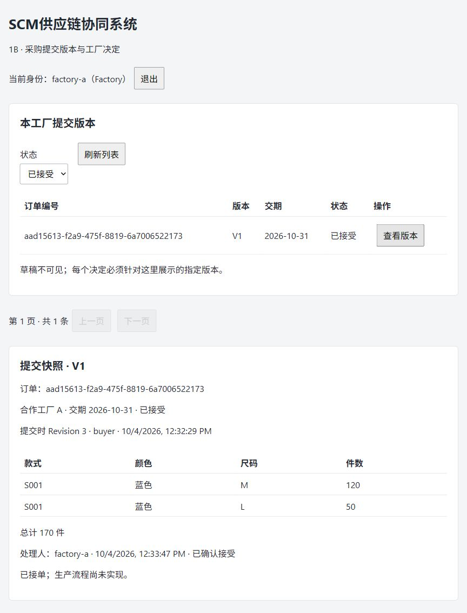
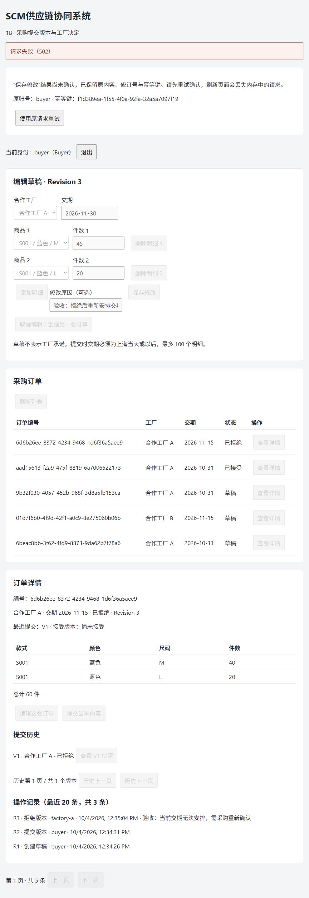
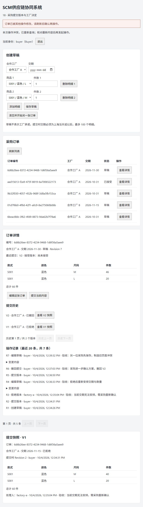

# 1B 实际验证记录

日期：2026-10-04（Asia/Shanghai）。状态：已实现并完成本地验证，等待用户验收。范围为采购确认，不代表整个 SCM 或跨服务协作完成。[接口契约](API-1B.md)、[实施计划](../PLAN-1B.md)、[1A 历史结果](VALIDATION-1A.md)。

## 环境与版本

本轮沿用 1A 已固定组合，未增加运行依赖或更新包版本：Windows / PowerShell，Docker Desktop Linux 引擎；.NET SDK 10.0.401 / Runtime 10.0.12；EF Core / Relational / dotnet-ef 10.0.12；Npgsql EF Provider 10.0.3；PostgreSQL 18.6 bookworm，镜像 digest `sha256:3725f4e2499eef5134592b3b4ab79a543ed7f8e533b05b5b637af926630f6650`；Node 22.20.0 / npm 10.9.3；React 19.3.0 / TypeScript 7.0.2 / Vite 8.3.2 / React 插件 6.1.1。

版本来源核实记录见 1A 文档，本轮不把已有元数据检查描述为新检查。本轮实际锁定还原、构建、真实迁移、运行和测试结果如下；API 增加显式 Application 项目引用，相关锁文件项目引用元数据同步。

## 执行结果

| 实际执行 | 结果 |
| --- | --- |
| `dotnet restore ScmCollaboration.slnx --locked-mode` | 退出码 0，既有锁定版本还原成功 |
| `dotnet build ScmCollaboration.slnx --no-restore` | 退出码 0，0 警告、0 错误 |
| `dotnet ef migrations add OrderSubmission --project src/Procurement.Persistence --startup-project src/Procurement.Api` | 退出码 0，最终迁移为 `20261004042434_OrderSubmission` |
| `dotnet test ScmCollaboration.slnx --no-restore --logger 'trx;LogFileName=1b.trx' --results-directory artifacts/tests` | 退出码 0，49 通过、0 失败、0 跳过 |
| `npm ci --prefix web --offline` | 退出码 0，锁文件还原成功，未引入新包 |
| `npm run build --prefix web` | 退出码 0，TypeScript 检查与 Vite 构建通过；页面恢复边界修复后再次通过 |
| `scripts/start-api.ps1 -InitializeOnly` | 退出码 0，演示库升级和预置成功，未清库 |
| `dotnet run --project src/Procurement.Api --no-build --no-launch-profile` | 实际运行于 127.0.0.1:5180，Development |
| `npm run dev --prefix web -- --host 127.0.0.1 --port 5173 --strictPort` | 实际运行于 127.0.0.1:5173 |
| `/health/ready`、`/openapi/v1.json` | 实际 200；OpenAPI 包含全部 1B 路由 |

最终 TRX 位于 `artifacts/tests/1b.trx`，已读取统计确认；理论测试每组输入各计一项。`scripts/test.ps1` 已更新相同结果文件名，入口保持不变。运行产物不提交。

| 测试类 | 通过数量 | 范围 |
| --- | --- | --- |
| DomainTests | 11 | 1A 领域规则回归 |
| OrderConfirmationTests | 9 | 状态、快照、明细稳定编号、100 条上限、原因、提交日期及上海跨日 |
| IntegrationTests | 15 | 1A 真实 PostgreSQL / HTTP、登录隔离、创建幂等及回滚回归 |
| ConfirmationIntegrationTests | 14 | 1B 真实 PostgreSQL / HTTP、并发、决定、重放、故障恢复及旧库升级 |

真实集成数据库是专用 `scm_procurement_test`，未使用 EF 内存数据库。测试集合共享初始化并关闭并行清库；并发用例内部使用独立请求、DbContext 和测试专用 SaveChanges 屏障，确保双方已读取同一 Revision 后再竞争保存。屏障不进入业务代码。

已验证：

- 编辑保留原 SKU 的 LineId，新 SKU 有新编号；无变更不推进 Revision；非法输入不部分修改聚合。
- 创建/编辑的 1–100 条明细上限；正数量及 SKU 唯一；过去交期可暂存但不能提交，上海当天允许；上海午夜与 UTC 午夜不同。
- Submitted 不能直接编辑；Accepted 不能编辑、重提、撤回或改拒绝；旧版本不能决定新版本；终态不能覆盖。
- 撤回、删除明细、改厂、重提和 API 重启不改变旧快照；两厂只能看自己的历史，伪造请求体 FactoryId 无效；品牌审计仅品牌可读。
- 拒绝/撤回原因空白或超过 500 字符为 400，状态/审计不推进；去首尾空白后重放原结果。
- 同 Revision 的 edit/edit、edit/submit、submit/submit、accept/withdraw、accept/reject 五组竞争，恰好一方 200、一方 409；数据库只保留胜者状态、修订、成功审计与请求结果。
- 8 个同键并发提交、8 个同键并发接单各只有一份事实及审计；原响应/DecisionId 相同；异内容及新键重复决定为 409；原键重放不因后来 Revision 变化而失败。
- 提交及接单保存 SQL 后、事务提交前注入失败，业务、版本、审计、请求结果一起回滚；同键重试恢复。
- 成功后丢弃首次响应正文、重启 API，原键返回已提交结果。这是调用者不使用首次结果的模拟，**未注入真实 TCP 断流**。
- 从真实 1A 迁移结构建立旧数据，再应用 1B 迁移：订单/明细编号、用户密码哈希验证、创建审计和旧幂等响应保留。该场景使用专用测试库内独立 schema，清理不触及演示库。

测试过程中发现并修复两项持久化问题：领域生成的明细 GUID 必须配置 ValueGeneratedNever，新增明细才能插入；决定竞争时版本 Status 也需作为并发条件，防止两个不同决定先更新同一版本时出现混合终态。上述最终测试覆盖修复后的行为。

## 演示库升级与保留

升级前通过 pg_dump 备份 `scm_procurement`，文件为 `artifacts/backups/scm-procurement-before-1b-20261004.sql`，12932 字节；文件含演示账号哈希，已被 Git 忽略。此为本地备份，未进行恢复演练。

实际迁移历史包含 `20261003111703_InitialDraft` 和 `20261004042434_OrderSubmission`。升级后按原编号实查，1A 的 3 张订单均保留；页面创建 2 张新验收订单后共 5 张。原 `.env`、依赖版本和 Articles 内容保持原样。

## 浏览器实际验收

1. buyer 创建订单 `aad15613-f2a9-475f-8819-6a7006522173`：工厂 A、交期 2026-10-31、M 100 / L 50；编辑 M 120 后 R2、170 件；提交为 V1/R3；factory-a 查看并接受后 Accepted/R4。factory-b 的列表没有此版本。
2. 第二张订单 `6d6b26ee-8372-4234-9468-1d6f36a5aee9`：V1 为 2026-11-15、M 40 / L 20。空白拒绝原因时按钮禁用；填写原因后拒绝，R3。服务端相同规则另有 HTTP 测试。
3. buyer 编辑第二单。停止本次启动的 API，保存得到 502，页面保留键 `f1d389ea-1f55-4f0a-92fa-32a5a7097f19` 和输入；恢复后原请求保存为 R4，交期 2026-11-30、M 45 / L 20。数据库该键结果记录与 R4 修改审计各为 1。
4. 重提得到 V2/R5，填写原因撤回得到 Draft/R6。页面 V1 仍为原交期、60 件、Rejected；V2 为新交期、65 件、Withdrawn。
5. 用独立 HTTP 请求模拟另一采购先修改为 M 46、R7。仍持有 R6 的页面提交收到 409，重新显示 R7/66 件，没有生成 V3；用户必须再次确认新操作。
6. 临时仅在 API 进程更换签名键，模拟旧会话失效。页面提交遇到 401 后保留键 `3544c92f-ccf0-4830-a203-197595a43ea6`，回到登录；buyer 重新登录、原请求重试得到 V3/R8。数据库实查该键结果和 V3 各为 1，没有空成功结果。此模拟并非等待 JWT 自然到期。演示结束已恢复 `.env` 原签名键，文件未改动。

页面恢复检查后补上了 401 保留原请求、成功响应缺失/不完整时不清除待确认请求，以及查询失败时不宣称刷新成功。401 恢复已在浏览器验证；响应正文损坏的保护通过类型检查/构建和代码检查，未做网络正文截断注入。

最终差异检查通过；对本轮新增/修改文本扫描 `.env` 中实际的四项密钥/密码，匹配为 0。`.env`、TRX、备份和构建产物被忽略，4 份当前交付文档的本地链接均存在。Articles 工作区差异为 0。

## 未执行与教学简化

- GitHub Actions 配置已更新并沿用真实 PostgreSQL 工作流；本轮没有推送或远端 CI 运行，不能称为 CI 已通过。
- 页面使用原生表单/表格、fetch 和内存状态，未添加前端测试框架或逐组件快照测试。浏览器刷新或确认退出会丢失待确认请求，持久恢复尚未实现。
- 只有采购一个业务服务；没有领域事件、RabbitMQ、Outbox/Inbox 或自动生产任务。消息可靠性在 1C 开始验收。
- 接单后的交期协商、减量、取消、换厂，以及生产、质量、发货、ERP、完整容器化和 AWS 仍是后续阶段。
- 没有压力测试、TCP 响应截断注入、云部署或付费资源。本记录只证明上述环境和场景内的功能与一致性，不宣称性能、生产规模或业务收益。
